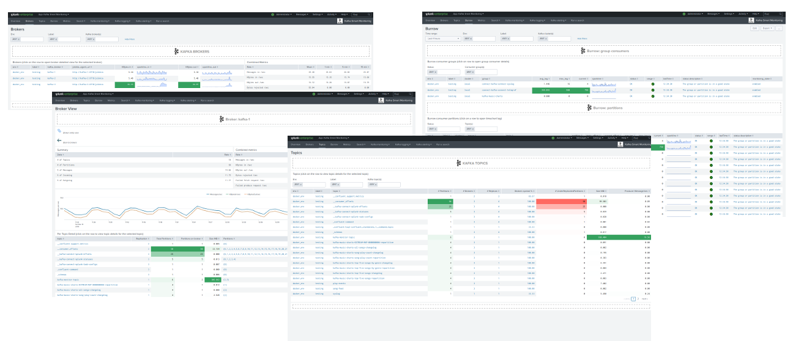

# Kafka Smart Monitoring for Splunk

| branch | build status |
| ---    | ---          |
| master | 

Copyright 2018-2019 Guilhem Marchand

Licensed under the Apache License, Version 2.0 (the "License");
you may not use this file except in compliance with the License.
You may obtain a copy of the License at

http://www.apache.org/licenses/LICENSE-2.0

Unless required by applicable law or agreed to in writing, software
distributed under the License is distributed on an "AS IS" BASIS,
WITHOUT WARRANTIES OR CONDITIONS OF ANY KIND, either express or implied.
See the License for the specific language governing permissions and
limitations under the License.

# Welcome to the Splunk application for Kafka monitoring

The Splunk application for Telegraf Kafka monitoring provides smart insight monitoring for Apache Kafka components.

**Please consult the online documentation:** https://telegraf-kafka.readthedocs.io

**The ITSI module and the Splunk core application for Apache Kafka end to end monitoring leverage the best components to provide a key layer monitoring for your Kafka infrastructure :**

- Telegraf from Influxdata (https://github.com/influxdata/telegraf)
- Jolokia for the remote JMX collection over http (https://jolokia.org)
- Telegraf Jolokia2 input plugin (https://github.com/influxdata/telegraf/tree/master/plugins/inputs/jolokia2)
- Telegraf Zookeeper input plugin (https://github.com/influxdata/telegraf/tree/master/plugins/inputs/zookeeper)
- LinkedIn Kafka monitor to provide end to end monitoring (https://github.com/linkedin/kafka-monitor)

