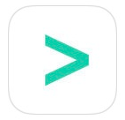
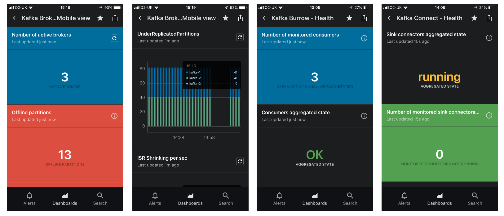
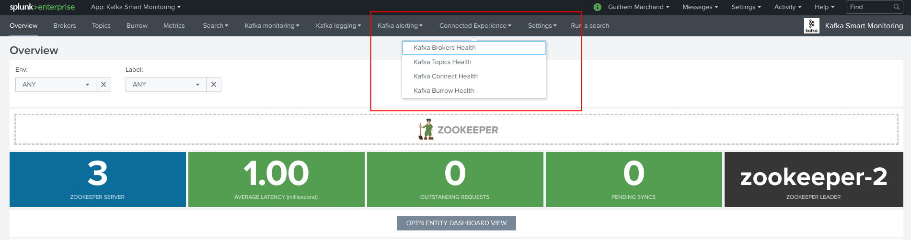
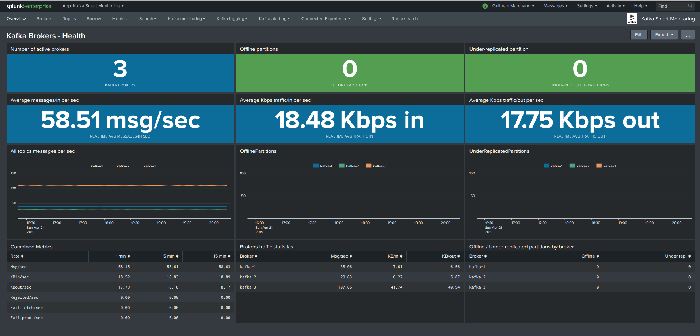
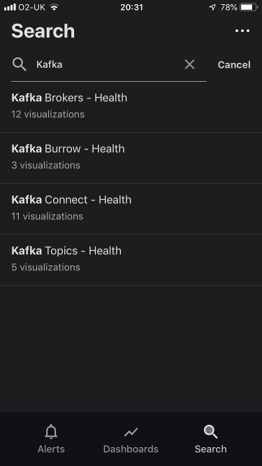
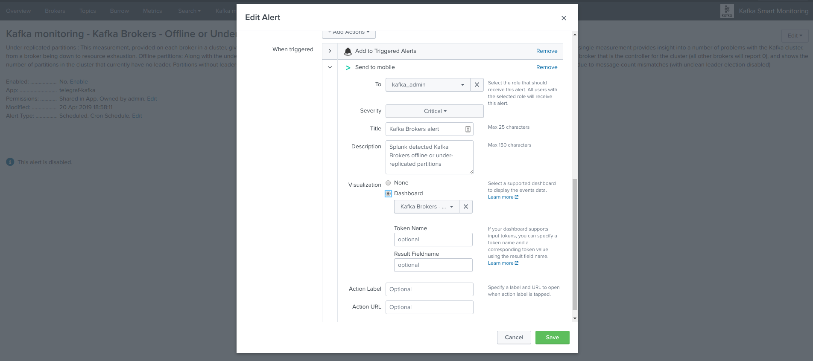
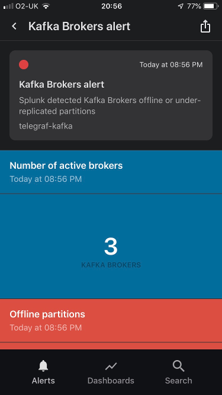

Splunk Connected experience for Cloud Gateway
#############################################

**Connected experience dashboards are builtin dashboards optimised for visualization on Splunk Mobile and Splunk TV with Splunk Cloud gateway:**

https://docs.splunk.com/Documentation/Mobile

Using Splunk Cloud Gateway and the Connected Experience dashboards, you can easily send data to your mobile Apple TV and device users with compatible and optimized dashboards.

*Screenshots from some of the Connected Experience dashboards in Apple Iphone devices:*

Access the Connected Experience dashboards
==========================================

The builtin Connected Experience dashboards are available from the "Connected Experience" menu in the Splunk application:

Although these dashboards are specially designed for the Splunk Connected experience, these are entirely compatible with Splunk Web:

For these dashboards to be available from your Apple devices, the builtin permissions share the dashboards to the global level of the Splunk search instance(s). (See metadata/default.meta)

Deploy and configure Splunk Cloud Gateway
=========================================

Download, install and configure the Splunk Cloud Gateway application in your environment:

https://splunkbase.splunk.com/app/4250/

Once you configured Splunk Cloud Gateway and registered a device, you can search for the Kafka Connected Experience dashboards:

Open any of the dashboards to start your amazing Splunk Connected journey!

Send to mobile alert action
===========================

With Splunk Mobile and Splunk Cloud Gateway, you can configure a Kafka alert to send a notification to your apple device, and link with the dashboard of your choice:

https://docs.splunk.com/Documentation/Alerts/latest/Alerts/SendAlerts

The application provides a builtin **"kafka_admin"** role that we suggest you use for Kafka alerting, make sure the users that should receive the Kafka alert notifications are members of the role.

Shall an alert trigger, a notification will be sent to the members of the **kafka_admin** role that have a registered device:

