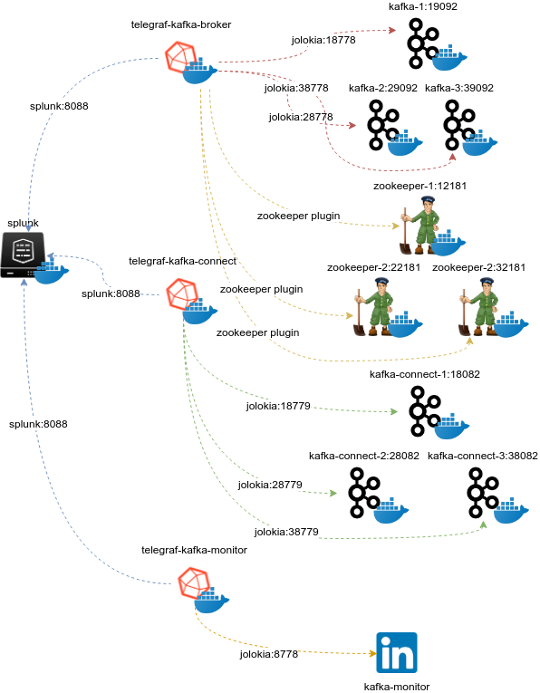
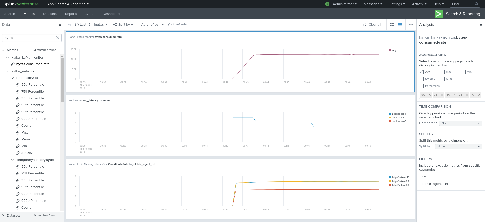

Docker testing templates
########################

**Docker compose templates are provided in the following repository:**

https://github.com/guilhemmarchand/kafka-docker-splunk

**Using the docker templates allows you to create a full pre-configured Kafka environment with docker, just in 30 seconds.**

*Example:*

- Zookeeper cluster (3 nodes)
- Kafka broker cluster (3 nodes)
- Kafka connect cluster (1 node, can be extended up to 3 or more with additional config)
- Confluent schema-registry
- Confluent kafka-rest
- Confluent ksql-server
- Kafka Xinfra SLA monitor container
- Telegraf container polling and sending to your Splunk metric store
- Yahoo Kafka Manager
- Confluent Interceptor console collector
- Kafka Burrow Consumer lag Monitoring

**Start the template, have a very short coffee (approx. 30 sec), open Splunk, install the Metrics workspace app and observe the magic happening !**

