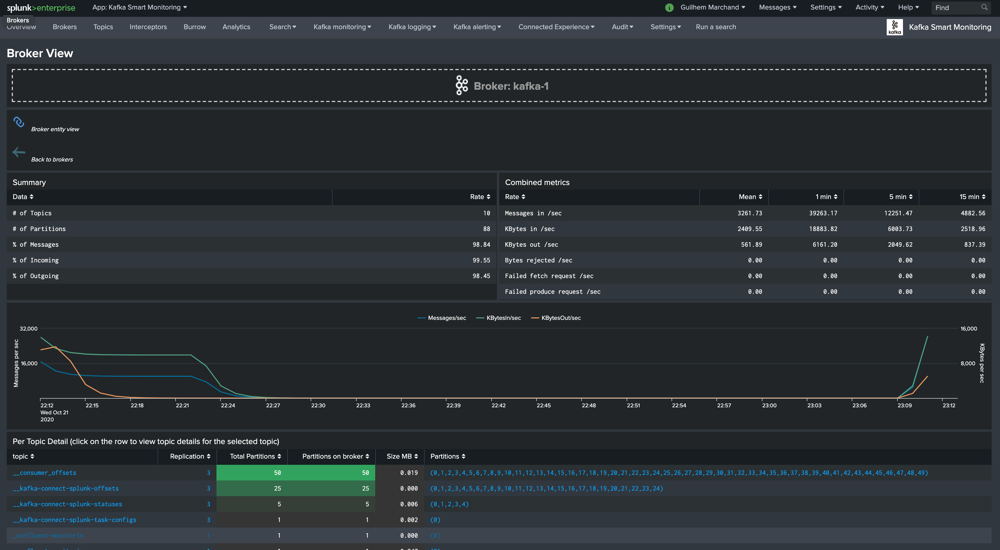
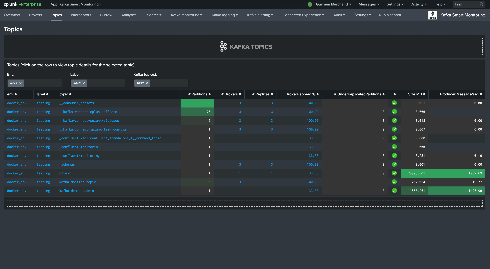
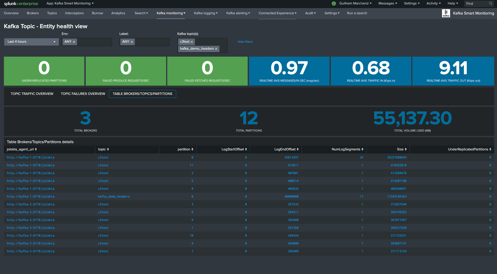

Splunk dashboards (health views)
================================

Overview (landing page)
#######################

The Splunk application home page provides an overview of the Kafka infrastructure:

.. image:: img/coremain.png
   :alt: coremain.png
   :align: center

Overview Brokers
################

The Brokers overview page inspired from Yahoo Kafka manager exposes the Kafka brokers and main metrics:

.. image:: img/overview_brokers.png
   :alt: overview_brokers.png
   :align: center

Broker drilldown page:

Overview Topics
################

The Topics overview page inspired from Yahoo Kafka manager exposes the Kafka topics and main metrics:

Topic drilldown page:

Zookeeper dashboard view
########################

.. image:: img/dashboard_zookeeper1.png
   :alt: dashboard_zookeeper1.png
   :align: center

Kafka broker dashboard view
###########################

.. image:: img/dashboard_kafka_broker_pic3.png
   :alt: dashboard_kafka_broker_pic3.png
   :align: center

.. image:: img/dashboard_kafka_broker_pic4.png
   :alt: dashboard_kafka_broker_pic4.png
   :align: center

.. image:: img/dashboard_kafka_broker_pic6.png
   :alt: dashboard_kafka_broker_pic6.png
   :align: center

.. image:: img/dashboard_kafka_broker_pic7.png
   :alt: dashboard_kafka_broker_pic7.png
   :align: center

.. image:: img/dashboard_kafka_broker_pic8.png
   :alt: dashboard_kafka_broker_pic8.png
   :align: center

Kafka topic dashboard view
##########################

Kafka connect dashboard view
############################

.. image:: img/dashboard_kafka_connect_pic2.png
   :alt: dashboard_kafka_connect_pic2.png
   :align: center

.. image:: img/dashboard_kafka_connect_pic4.png
   :alt: dashboard_kafka_connect_pic4.png
   :align: center

Kafka connect sink task dashboard view
######################################

.. image:: img/dashboard_kafka_connect_sink_pic2.png
   :alt: dashboard_kafka_connect_sink_pic2.png
   :align: center

.. image:: img/dashboard_kafka_connect_sink_pic3.png
   :alt: dashboard_kafka_connect_sink_pic3.png
   :align: center

Kafka connect source task dashboard view
########################################

.. image:: img/dashboard_kafka_connect_source_pic2.png
   :alt: dashboard_kafka_connect_source_pic2.png
   :align: center

Confluent schema-registry dashboard view
########################################

.. image:: img/dashboard_schema_registry_pic1.png
   :alt: dashboard_schema_registry_pic1.png
   :align: center

.. image:: img/dashboard_schema_registry_pic2.png
   :alt: dashboard_schema_registry_pic2.png
   :align: center

LinkedIn Kafka monitor view
###########################

.. image:: img/dashboard_kafka_monitor_pic1.png
   :alt: dashboard_kafka_monitor_pic1.png
   :align: center

.. image:: img/dashboard_kafka_monitor_pic2.png
   :alt: dashboard_kafka_monitor_pic2.png
   :align: center

.. image:: img/dashboard_kafka_monitor_pic3.png
   :alt: dashboard_kafka_monitor_pic3.png
   :align: center

Burrow Kafka Consumers lagging view
###################################

