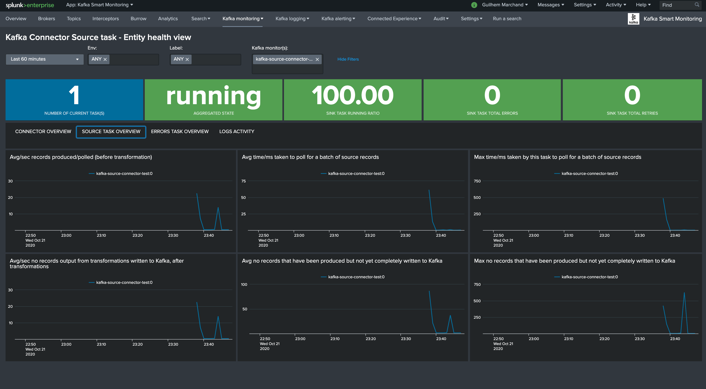

Splunk dashboards (health views)
================================

Overview (landing page)
#######################

The Splunk application home page provides an overview of the Kafka infrastructure:

.. image:: img/coremain.png
   :alt: coremain.png
   :align: center

Zookeeper dashboard view
########################

Kafka broker dashboard view
###########################

.. image:: img/dashboard_kafka_broker_pic1.png
   :alt: dashboard_kafka_broker_pic1.png
   :align: center

.. image:: img/dashboard_kafka_broker_pic2.png
   :alt: dashboard_kafka_broker_pic2.png
   :align: center

.. image:: img/dashboard_kafka_broker_pic5.png
   :alt: dashboard_kafka_broker_pic5.png
   :align: center

.. image:: img/dashboard_kafka_broker_pic9.png
   :alt: dashboard_kafka_broker_pic9.png
   :align: center

Kafka topic dashboard view
##########################

.. image:: img/dashboard_kafka_topic_pic1.png
   :alt: dashboard_kafka_topic_pic1.png
   :align: center

.. image:: img/dashboard_kafka_topic_pic2.png
   :alt: dashboard_kafka_topic_pic2.png
   :align: center

.. image:: img/dashboard_kafka_topic_pic3.png
   :alt: dashboard_kafka_topic_pic3.png
   :align: center

Kafka connect dashboard view
############################

.. image:: img/dashboard_kafka_connect_pic1.png
   :alt: dashboard_kafka_connect_pic1.png
   :align: center

.. image:: img/dashboard_kafka_connect_pic3.png
   :alt: dashboard_kafka_connect_pic3.png
   :align: center

.. image:: img/dashboard_kafka_connect_pic5.png
   :alt: dashboard_kafka_connect_pic5.png
   :align: center

Kafka connect sink task dashboard view
######################################

.. image:: img/dashboard_kafka_connect_sink_pic1.png
   :alt: dashboard_kafka_connect_sink_pic1.png
   :align: center

Kafka connect source task dashboard view
########################################

.. image:: img/dashboard_kafka_connect_source_pic1.png
   :alt: dashboard_kafka_connect_source_pic1.png
   :align: center

.. image:: img/dashboard_kafka_connect_source_pic3.png
   :alt: dashboard_kafka_connect_source_pic3.png
   :align: center

Confluent schema-registry dashboard view
########################################

.. image:: img/dashboard_schema_registry_pic2.png
   :alt: dashboard_schema_registry_pic2.png
   :align: center

LinkedIn Kafka monitor view
###########################

.. image:: img/dashboard_kafka_monitor_pic2.png
   :alt: dashboard_kafka_monitor_pic2.png
   :align: center

.. image:: img/dashboard_kafka_monitor_pic3.png
   :alt: dashboard_kafka_monitor_pic3.png
   :align: center
