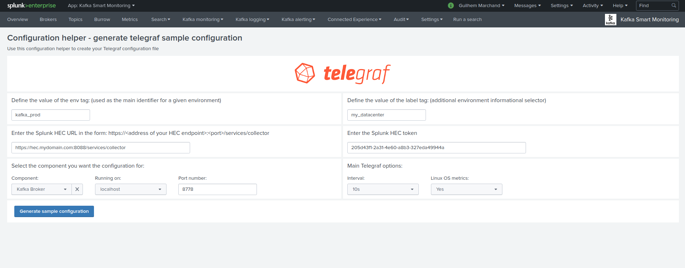
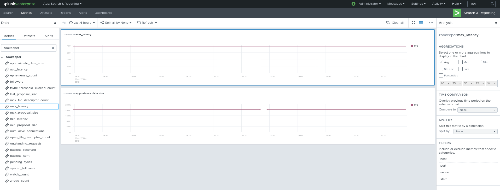
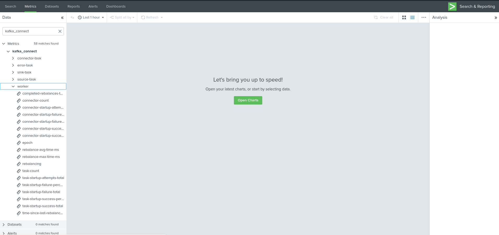
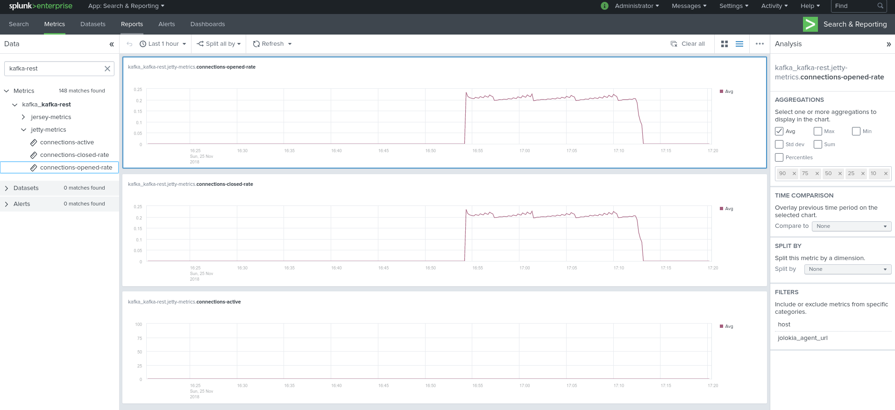
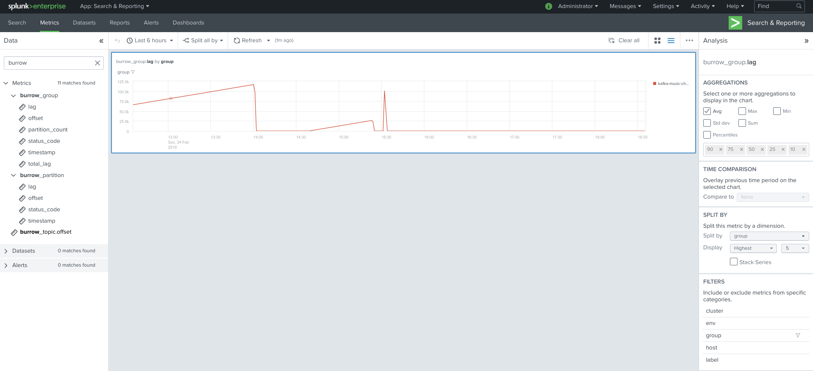

Implementation & data collection
################################

*Data collection diagram overview:*

.. image:: img/draw.io/overview_diagram.png
   :alt: overview_diagram
   :align: center

Splunk configuration
====================

Index definition
----------------

**The application relies by default on the creation of a metrics index called "telegraf_kafka":**

*indexes.conf example with no Splunk volume:*::

   [telegraf_kafka]
   coldPath = $SPLUNK_DB/telegraf_kafka/colddb
   datatype = metric
   homePath = $SPLUNK_DB/telegraf_kafka/db
   thawedPath = $SPLUNK_DB/telegraf_kafka/thaweddb

*indexes.conf example with Splunk volumes:*::

   [telegraf_kafka]
   coldPath = volume:cold/telegraf_kafka/colddb
   datatype = metric
   homePath = volume:primary/telegraf_kafka/db
   thawedPath = $SPLUNK_DB/telegraf_kafka/thaweddb

In a Splunk distributed configuration (cluster of indexers), this configuration stands on the cluster master node.

All Splunk searches included in the added refer to the utilisation of a macro called **"telegraf_kafka_index"** configured in:

* telegraf-kafka/default/macros.conf

If you wish to use a different index model, this macro shall be customized to override the default model.

Role membership
---------------

The application creates a builtin Splunk role called "**kafka_admin**" that provides:

- write permissions to the application name space
- write permissions to the various KVstore based lookups used for configuration purposes of the application
- can be used to automatically notify the Kafka administrators if you use Splunk Cloud Gateway and Splunk Mobile Connected Experience

We suggest that you configure the Kafka administrators to be member of this role. (by user configuration, role mapping or inheritance)

HEC input ingestion and definition
----------------------------------

**The default recommended way of ingesting the Kafka metrics is using the HTTP Events Collector method which requires the creation of an HEC input.**

*inputs.conf example:*

::

   [http://telegraf_kafka_monitoring]
   disabled = 0
   index = telegraf_kafka
   token = 205d43f1-2a31-4e60-a8b3-327eda49944a

If you create the HEC input via Splunk Web interface, it is not required to select an explicit value for source and sourcetype.

The HEC input will be ideally relying on a load balancer to provides resiliency and load balancing across your HEC input nodes.

Other ingesting methods
-----------------------

**There are other methods possible to ingest the Kafka metrics in Splunk:**

* TCP input (graphite format with tags support)
* KAFKA ingestion (Kafka destination from Telegraf in graphite format with tags support, and Splunk connect for Kafka)
* File monitoring with standard Splunk input monitors (file output plugin from Telegraf)

Notes: In the very specific context of monitoring Kafka, it is not a good design to use Kafka as the ingestion method since you will most likely never be able to know when an issue happens on Kafka.

**These methods require the deployment of an additional Technology addon:** https://splunkbase.splunk.com/app/4193

**These methods are heavily described here:** https://da-itsi-telegraf-os.readthedocs.io/en/latest/telegraf.html

Telegraf installation and configuration
=======================================

Telegraf installation, configuration and start
----------------------------------------------

**If you are running Telegraf as a regular process in machine, the standard installation of Telegraf is really straightforward, consult:**

- https://github.com/influxdata/telegraf

**If you have a Splunk Universal Forwarder deployment, you can deploy, run and maintain Telegraf and its configuration through a Splunk application (TA), consult:**

- https://da-itsi-telegraf-os.readthedocs.io/en/latest/telegraf.html#telegraf-deployment-as-splunk-application-deployed-by-splunk-ta

An example of a ready to use TA application can be found here:

- https://github.com/guilhemmarchand/TA-telegraf-amd64

For Splunk customers, this solution has various advantages as you can deploy and maintain using your existing Splunk infrastructure.

**Telegraf is extremely container friendly, a container approach is very convenient as you can easily run multiple Telegraf containers to monitor each of the Kafka infrastructure components:**

- https://hub.docker.com/r/_/telegraf/

**Data collection environment design:**

The most scalalable and highly available design in term of where placing the Telegraf instances is to deploy Telegraf locally on each server to be monitored (and collect locally the component) or running as a side car container for Kubernetes based environments.

It is to possible to collect multiple instances of multiple components via a unique Telegraf instance, however there will be a limit where issues can start, and this design will not provide high availability as the failure of this instance will impact the whole metric collection.

Telegraf configuration generator
================================

**The application provides a builtin user interface you can use to generate a telegraf.conf configuration file based on your parameters and for all the components to be monitored:**

* Menu Settings / Telegraf Configuration Generator

Telegraf output configuration
=============================

Whether you will be running Telegraf in various containers, or installed as a regular software within the different servers composing your Kafka
infrastructure, a minimal configuration is required to teach Telegraf how to forward the metrics to your Splunk deployment.

**Telegraf is able to send to data to Splunk in different ways:**

* Splunk HTTP Events Collector (HEC) - Since Telegraf v1.8
* Splunk TCP inputs in Graphite format with tags support and the TA for Telegraf
* Apache Kafka topic in Graphite format with tags support and the TA for Telegraf and Splunk connect for Kafka

**Who watches for the watcher?**

As you are running a Kafka deployment, it would seem very logical to produce metrics in a Kafka topic.
However, it presents a specific concern for Kafka itself.

If you use this same system for monitoring Kafka itself, it is very likely that you will never know when Kafka is broken because the data flow for your monitoring system will be broken as well.

The recommendation is to rely either on Splunk HEC or TCP inputs to forward Telegraf metrics data for the Kafka monitoring.

**A minimal configuration for telegraf.conf, running in container or as a regular process in machine and forwarding to HEC:**

::

    [global_tags]
      # the env tag is used by the application for multi-environments management
      env = "my_env"
      # the label tag is an optional tag used by the application that you can use as additional label for the services or infrastructure
      label = "my_env_label"

    [agent]
      interval = "10s"
      flush_interval = "10s"
      hostname = "$HOSTNAME"

    # Regular OS monitoring for Linux OS

    # Read metrics about cpu usage
    [[inputs.cpu]]
      ## Whether to report per-cpu stats or not
      percpu = true
      ## Whether to report total system cpu stats or not
      totalcpu = true
      ## If true, collect raw CPU time metrics.
      collect_cpu_time = false
      ## If true, compute and report the sum of all non-idle CPU states.
      report_active = false

    # Read metrics about disk usage by mount point
    [[inputs.disk]]

      ## Ignore mount points by filesystem type.
      ignore_fs = ["tmpfs", "devtmpfs", "devfs"]

    # Read metrics about disk IO by device
    [[inputs.diskio]]

    # Get kernel statistics from /proc/stat
    [[inputs.kernel]]

    # Read metrics about memory usage
    [[inputs.mem]]

    # Get the number of processes and group them by status
    [[inputs.processes]]

    # Read metrics about swap memory usage
    [[inputs.swap]]

    # Read metrics about system load & uptime
    [[inputs.system]]

    # # Read metrics about network interface usage
    [[inputs.net]]

    # # Read TCP metrics such as established, time wait and sockets counts.
    [[inputs.netstat]]

    # # Monitor process cpu and memory usage
    [[inputs.procstat]]
       pattern = ".*"

    # outputs
    [[outputs.http]]
       url = "https://splunk:8088/services/collector"
       insecure_skip_verify = true
       data_format = "splunkmetric"
        ## Provides time, index, source overrides for the HEC
       splunkmetric_hec_routing = true
        ## Additional HTTP headers
        [outputs.http.headers]
       # Should be set manually to "application/json" for json data_format
          Content-Type = "application/json"
          Authorization = "Splunk 205d43f1-2a31-4e60-a8b3-327eda49944a"
          X-Splunk-Request-Channel = "205d43f1-2a31-4e60-a8b3-327eda49944a"

**If for some reasons, you have to use either of the 2 other solutions, please consult:**

* https://da-itsi-telegraf-os.readthedocs.io/en/latest/telegraf.html

Notes: The configuration above provides out of the box OS monitoring for the hosts, which can be used by the Operating System monitoring application for Splunk:

https://splunkbase.splunk.com/app/4271/

Jolokia JVM monitoring
======================

.. image:: img/jolokia_logo.png
   :alt: jolokia_logo.png
   :align: center

**The following Kafka components require Jolokia to be deployed and started, as the modern and efficient interface to JMX that is collected by Telegraf:**

* Zookeeper
* Apache Kafka Brokers
* Apache Kafka Connect
* Confluent schema-registry
* Confluent ksql-server
* Confluent kafka-rest

**For the complete documentation of Jolokia, see:**

- https://jolokia.org

**Jolokia JVM agent can be started in 2 ways, either as using the -javaagent argument during the start of the JVM, or on the fly by attaching Jolokia to the PID ot the JVM:**

- https://jolokia.org/reference/html/agents.html#agents-jvm

Starting Jolokia with the JVM
=============================

**To start Jolokia agent using the -javaagent argument, use such option at the start of the JVM:**

::

    -javaagent:/opt/jolokia/jolokia.jar=port=8778,host=0.0.0.0

*Note: This method is the method used in the docker example within this documentation by using the environment variables of the container.*

**When running on dedicated servers or virtual machines, update the relevant systemd configuration file to start Jolokia automatically:**

For Kafka brokers
-----------------

**For bare-metals and dedicated VMs:**

- Edit: ``/lib/systemd/system/confluent-kafka.service``

- Add ``-javaagent`` argument:

::

    [Unit]
    Description=Apache Kafka - broker
    Documentation=http://docs.confluent.io/
    After=network.target confluent-zookeeper.target

    [Service]
    Type=simple
    User=cp-kafka
    Group=confluent
    ExecStart=/usr/bin/kafka-server-start /etc/kafka/server.properties
    Environment="KAFKA_OPTS=-javaagent:/opt/jolokia/jolokia.jar=port=8778,host=0.0.0.0"
    TimeoutStopSec=180
    Restart=no

    [Install]
    WantedBy=multi-user.target

- Reload systemd and restart:

::

    sudo systemctl daemon-restart
    sudo systemctl restart confluent-kafka

**For container based environments:**

*Define the following environment variable when starting the containers:*

::

    KAFKA_OPTS: "-javaagent:/opt/jolokia/jolokia.jar=port=8778,host=0.0.0.0"

For Kafka Connect
-----------------

**For bare-metals and dedicated VMs:**

- Edit: ``/lib/systemd/system/confluent-kafka-connect.service``

- Add ``-javaagent`` argument:

::

    [Unit]
    Description=Apache Kafka Connect - distributed
    Documentation=http://docs.confluent.io/
    After=network.target confluent-kafka.target

    [Service]
    Type=simple
    User=cp-kafka-connect
    Group=confluent
    ExecStart=/usr/bin/connect-distributed /etc/kafka/connect-distributed.properties
    Environment="KAFKA_OPTS=-javaagent:/opt/jolokia/jolokia.jar=port=8778,host=0.0.0.0"
    Environment="LOG_DIR=/var/log/connect"
    TimeoutStopSec=180
    Restart=no

    [Install]
    WantedBy=multi-user.target

- Reload systemd and restart:

::

    sudo systemctl daemon-restart
    sudo systemctl restart confluent-kafka-connect

**For container based environments:**

*Define the following environment variable when starting the containers:*

::

    KAFKA_OPTS: "-javaagent:/opt/jolokia/jolokia.jar=port=8778,host=0.0.0.0"

For Confluent schema-registry
-----------------------------

**For bare-metals and dedicated VMs:**

- Edit: ``/lib/systemd/system/confluent-schema-registry.service``

- Add ``-javaagent`` argument:

::

    [Unit]
    Description=RESTful Avro schema registry for Apache Kafka
    Documentation=http://docs.confluent.io/
    After=network.target confluent-kafka.target

    [Service]
    Type=simple
    User=cp-schema-registry
    Group=confluent
    Environment="LOG_DIR=/var/log/confluent/schema-registry"
    Environment="SCHEMA_REGISTRY_OPTS=-javaagent:/opt/jolokia/jolokia.jar=port=8778,host=0.0.0.0"
    ExecStart=/usr/bin/schema-registry-start /etc/schema-registry/schema-registry.properties
    TimeoutStopSec=180
    Restart=no

    [Install]
    WantedBy=multi-user.target

- Reload systemd and restart:

::

    sudo systemctl daemon-restart
    sudo systemctl restart confluent-schema-registry

**For container based environments:**

*Define the following environment variable when starting the containers:*

::

    SCHEMA_REGISTRY_OPTS: "-javaagent:/opt/jolokia/jolokia.jar=port=8778,host=0.0.0.0"

For Confluent ksql-server
-------------------------

**For bare-metals and dedicated VMs:**

- Edit: ``/lib/systemd/system/confluent-ksql.service``

- Add ``-javaagent`` argument:

::

    [Unit]
    Description=Streaming SQL engine for Apache Kafka
    Documentation=http://docs.confluent.io/
    After=network.target confluent-kafka.target confluent-schema-registry.target

    [Service]
    Type=simple
    User=cp-ksql
    Group=confluent
    Environment="LOG_DIR=/var/log/confluent/ksql"
    Environment="KSQL_OPTS=-javaagent:/opt/jolokia/jolokia.jar=port=8778,host=0.0.0.0"
    ExecStart=/usr/bin/ksql-server-start /etc/ksql/ksql-server.properties
    TimeoutStopSec=180
    Restart=no

    [Install]
    WantedBy=multi-user.target

- Reload systemd and restart:

::

    sudo systemctl daemon-restart
    sudo systemctl restart confluent-ksql

**For container based environments:**

*Define the following environment variable when starting the containers:*

::

    KSQL_OPTS: "-javaagent:/opt/jolokia/jolokia.jar=port=8778,host=0.0.0.0"

For Confluent kafka-rest
------------------------

**For bare-metals and dedicated VMs:**

- Edit: ``/lib/systemd/system/confluent-kafka-rest.service``

- Add ``-javaagent`` argument:

::

    [Unit]
    Description=A REST proxy for Apache Kafka
    Documentation=http://docs.confluent.io/
    After=network.target confluent-kafka.target

    [Service]
    Type=simple
    User=cp-kafka-rest
    Group=confluent
    Environment="LOG_DIR=/var/log/confluent/kafka-rest"
    Environment="KAFKAREST_OPTS=-javaagent:/opt/jolokia/jolokia.jar=port=8778,host=0.0.0.0"

    ExecStart=/usr/bin/kafka-rest-start /etc/kafka-rest/kafka-rest.properties
    TimeoutStopSec=180
    Restart=no

    [Install]
    WantedBy=multi-user.target

- Reload systemd and restart:

::

    sudo systemctl daemon-restart
    sudo systemctl restart confluent-kafka-rest

**For container based environments:**

*Define the following environment variable when starting the containers:*

::

    KAFKAREST_OPTS: "-javaagent:/opt/jolokia/jolokia.jar=port=8778,host=0.0.0.0"

Notes: "KAFKAREST_OPTS" is not a typo, this is the real name of the environment variable for some reason.

Starting Jolokia on the fly
===========================

**To attach Jolokia agent to an existing JVM, identify its process ID (PID), simplistic example:**

::

    ps -ef | grep 'kafka.properties' | grep -v grep | awk '{print $1}'

**Then:**

::

    java -jar /opt/jolokia/jolokia.jar --host 0.0.0.0 --port 8778 start <PID>

*Add this operation to any custom init scripts you use to start the Kafka components.*

Zookeeper monitoring
====================

*Since the v1.1.31, Zookeeper metrics are now collected via JMX and Jolokia rather than the Telegraf Zookeeper plugin.*

Collecting with Telegraf
------------------------

Depending on how you run Kafka and your architecture preferences, you may prefer to collect all the brokers metrics from one Telegraf collector, or installed locally on the Kafka brocker machine.

**Connecting to multiple remote Jolokia instances:**

::

    [[inputs.jolokia2_agent]]
      name_prefix = "zk_"
      urls = ["http://zookeeper-1:8778/jolokia","http://zookeeper-2:8778/jolokia","http://zookeeper-3:8778/jolokia"]

**Connecting to the local Jolokia instance:**

::

    # Zookeeper JVM monitoring
    [[inputs.jolokia2_agent]]
      name_prefix = "zk_"
      urls = ["http://$HOSTNAME:8778/jolokia"]

Full telegraf.conf example
--------------------------

*The following telegraf.conf collects a cluster of 3 Zookeeper nodes:*

::

    [global_tags]
      # the env tag is used by the application for multi-environments management
      env = "my_env"
      # the label tag is an optional tag used by the application that you can use as additional label for the services or infrastructure
      label = "my_env_label"

    [agent]
      interval = "10s"
      flush_interval = "10s"
      hostname = "$HOSTNAME"

    # outputs
    [[outputs.http]]
       url = "https://splunk:8088/services/collector"
       insecure_skip_verify = true
       data_format = "splunkmetric"
        ## Provides time, index, source overrides for the HEC
       splunkmetric_hec_routing = true
        ## Additional HTTP headers
        [outputs.http.headers]
       # Should be set manually to "application/json" for json data_format
          Content-Type = "application/json"
          Authorization = "Splunk 205d43f1-2a31-4e60-a8b3-327eda49944a"
          X-Splunk-Request-Channel = "205d43f1-2a31-4e60-a8b3-327eda49944a"

    # Zookeeper JMX collection

    [[inputs.jolokia2_agent]]
      name_prefix = "zk_"
      urls = ["http://zookeeper-1:8778/jolokia","http://zookeeper-2:8778/jolokia","http://zookeeper-3:8778/jolokia"]

    [[inputs.jolokia2_agent.metric]]
      name  = "quorum"
      mbean = "org.apache.ZooKeeperService:name0=*"
      tag_keys = ["name0"]

    [[inputs.jolokia2_agent.metric]]
      name = "leader"
      mbean = "org.apache.ZooKeeperService:name0=*,name1=*,name2=Leader"
      tag_keys = ["name1"]

    [[inputs.jolokia2_agent.metric]]
      name = "follower"
      mbean = "org.apache.ZooKeeperService:name0=*,name1=*,name2=Follower"
      tag_keys = ["name1"]

**Visualization of metrics within the Splunk metrics workspace application:**

**Using mcatalog search command to verify data availability:**

::

    | mcatalog values(metric_name) values(_dims) where index=* metric_name=zk_*

Kafka brokers monitoring with Jolokia
=====================================

Collecting with Telegraf
------------------------

Depending on how you run Kafka and your architecture preferences, you may prefer to collect all the brokers metrics from one Telegraf collector, or installed locally on the Kafka brocker machine.

**Connecting to multiple remote Jolokia instances:**

::

    # Kafka JVM monitoring
    [[inputs.jolokia2_agent]]
      name_prefix = "kafka_"
      urls = ["http://kafka-1:18778/jolokia","http://kafka-2:28778/jolokia","http://kafka-3:38778/jolokia"]

**Connecting to the local Jolokia instance:**

::

    # Kafka JVM monitoring
    [[inputs.jolokia2_agent]]
      name_prefix = "kafka_"
      urls = ["http://$HOSTNAME:8778/jolokia"]

Full telegraf.conf example
--------------------------

*The following telegraf.conf collects a cluster of 3 Kafka brokers:*

::

    [global_tags]
      # the env tag is used by the application for multi-environments management
      env = "my_env"
      # the label tag is an optional tag used by the application that you can use as additional label for the services or infrastructure
      label = "my_env_label"

    [agent]
      interval = "10s"
      flush_interval = "10s"
      hostname = "$HOSTNAME"

    # outputs
    [[outputs.http]]
       url = "https://splunk:8088/services/collector"
       insecure_skip_verify = true
       data_format = "splunkmetric"
        ## Provides time, index, source overrides for the HEC
       splunkmetric_hec_routing = true
        ## Additional HTTP headers
        [outputs.http.headers]
       # Should be set manually to "application/json" for json data_format
          Content-Type = "application/json"
          Authorization = "Splunk 205d43f1-2a31-4e60-a8b3-327eda49944a"
          X-Splunk-Request-Channel = "205d43f1-2a31-4e60-a8b3-327eda49944a"

    # Kafka JVM monitoring

    [[inputs.jolokia2_agent]]
      name_prefix = "kafka_"
      urls = ["http://kafka-1:18778/jolokia","http://kafka-2:28778/jolokia","http://kafka-3:38778/jolokia"]

    [[inputs.jolokia2_agent.metric]]
      name         = "controller"
      mbean        = "kafka.controller:name=*,type=*"
      field_prefix = "$1."

    [[inputs.jolokia2_agent.metric]]
      name         = "replica_manager"
      mbean        = "kafka.server:name=*,type=ReplicaManager"
      field_prefix = "$1."

    [[inputs.jolokia2_agent.metric]]
      name         = "purgatory"
      mbean        = "kafka.server:delayedOperation=*,name=*,type=DelayedOperationPurgatory"
      field_prefix = "$1."
      field_name   = "$2"

    [[inputs.jolokia2_agent.metric]]
      name     = "client"
      mbean    = "kafka.server:client-id=*,type=*"
      tag_keys = ["client-id", "type"]

    [[inputs.jolokia2_agent.metric]]
      name         = "network"
      mbean        = "kafka.network:name=*,request=*,type=RequestMetrics"
      field_prefix = "$1."
      tag_keys     = ["request"]

    [[inputs.jolokia2_agent.metric]]
      name         = "network"
      mbean        = "kafka.network:name=ResponseQueueSize,type=RequestChannel"
      field_prefix = "ResponseQueueSize"
      tag_keys     = ["name"]

    [[inputs.jolokia2_agent.metric]]
      name         = "network"
      mbean        = "kafka.network:name=NetworkProcessorAvgIdlePercent,type=SocketServer"
      field_prefix = "NetworkProcessorAvgIdlePercent"
      tag_keys     = ["name"]

    [[inputs.jolokia2_agent.metric]]
      name         = "topics"
      mbean        = "kafka.server:name=*,type=BrokerTopicMetrics"
      field_prefix = "$1."

    [[inputs.jolokia2_agent.metric]]
      name         = "topic"
      mbean        = "kafka.server:name=*,topic=*,type=BrokerTopicMetrics"
      field_prefix = "$1."
      tag_keys     = ["topic"]

    [[inputs.jolokia2_agent.metric]]
      name       = "partition"
      mbean      = "kafka.log:name=*,partition=*,topic=*,type=Log"
      field_name = "$1"
      tag_keys   = ["topic", "partition"]

    [[inputs.jolokia2_agent.metric]]
      name       = "log"
      mbean      = "kafka.log:name=LogFlushRateAndTimeMs,type=LogFlushStats"
      field_name = "LogFlushRateAndTimeMs"
      tag_keys   = ["name"]

    [[inputs.jolokia2_agent.metric]]
      name       = "partition"
      mbean      = "kafka.cluster:name=UnderReplicated,partition=*,topic=*,type=Partition"
      field_name = "UnderReplicatedPartitions"
      tag_keys   = ["topic", "partition"]

    [[inputs.jolokia2_agent.metric]]
      name     = "request_handlers"
      mbean    = "kafka.server:name=RequestHandlerAvgIdlePercent,type=KafkaRequestHandlerPool"
      tag_keys = ["name"]

    # JVM garbage collector monitoring
    [[inputs.jolokia2_agent.metric]]
      name     = "jvm_garbage_collector"
      mbean    = "java.lang:name=*,type=GarbageCollector"
      paths    = ["CollectionTime", "CollectionCount", "LastGcInfo"]
      tag_keys = ["name"]

**Visualization of metrics within the Splunk metrics workspace application:**

.. image:: img/kafka_monitoring_metrics_workspace.png
   :alt: kafka_kafka_metrics_workspace.png
   :align: center

**Using mcatalog search command to verify data availability:**

::

    | mcatalog values(metric_name) values(_dims) where index=* metric_name=kafka_*.*

Kafka connect monitoring
========================

Collecting with Telegraf
------------------------

**Connecting to multiple remote Jolokia instances:**

::

   # Kafka-connect JVM monitoring
   [[inputs.jolokia2_agent]]
     name_prefix = "kafka_connect."
     urls = ["http://kafka-connect-1:18779/jolokia","http://kafka-connect-2:28779/jolokia","http://kafka-connect-3:38779/jolokia"]

**Connecting to local Jolokia instance:**

::

   # Kafka-connect JVM monitoring
    [[inputs.jolokia2_agent]]
      name_prefix = "kafka_connect."
      urls = ["http://$HOSTNAME:8778/jolokia"]

Full telegraf.conf example
--------------------------

*bellow a full telegraf.conf example:*

::

   [global_tags]
     # the env tag is used by the application for multi-environments management
     env = "my_env"
     # the label tag is an optional tag used by the application that you can use as additional label for the services or infrastructure
     label = "my_env_label"

   [agent]
     interval = "10s"
     flush_interval = "10s"
     hostname = "$HOSTNAME"

   # outputs
   [[outputs.http]]
      url = "https://splunk:8088/services/collector"
      insecure_skip_verify = true
      data_format = "splunkmetric"
       ## Provides time, index, source overrides for the HEC
      splunkmetric_hec_routing = true
       ## Additional HTTP headers
       [outputs.http.headers]
      # Should be set manually to "application/json" for json data_format
         Content-Type = "application/json"
         Authorization = "Splunk 205d43f1-2a31-4e60-a8b3-327eda49944a"
         X-Splunk-Request-Channel = "205d43f1-2a31-4e60-a8b3-327eda49944a"

   # Kafka-connect JVM monitoring

   [[inputs.jolokia2_agent]]
     name_prefix = "kafka_connect."
     urls = ["http://kafka-connect-1:18779/jolokia","http://kafka-connect-2:28779/jolokia","http://kafka-connect-3:38779/jolokia"]

   [[inputs.jolokia2_agent.metric]]
     name         = "worker"
     mbean        = "kafka.connect:type=connect-worker-metrics"

   [[inputs.jolokia2_agent.metric]]
     name         = "worker"
     mbean        = "kafka.connect:type=connect-worker-rebalance-metrics"

   [[inputs.jolokia2_agent.metric]]
     name         = "connector-task"
     mbean        = "kafka.connect:type=connector-task-metrics,connector=*,task=*"
     tag_keys = ["connector", "task"]

   [[inputs.jolokia2_agent.metric]]
     name         = "sink-task"
     mbean        = "kafka.connect:type=sink-task-metrics,connector=*,task=*"
     tag_keys = ["connector", "task"]

   [[inputs.jolokia2_agent.metric]]
     name         = "source-task"
     mbean        = "kafka.connect:type=source-task-metrics,connector=*,task=*"
     tag_keys = ["connector", "task"]

   [[inputs.jolokia2_agent.metric]]
     name         = "error-task"
     mbean        = "kafka.connect:type=task-error-metrics,connector=*,task=*"
     tag_keys = ["connector", "task"]

   # Kafka connect return a status value which is non numerical
   # Using the enum processor with the following configuration replaces the string value by our mapping
   [[processors.enum]]
     [[processors.enum.mapping]]
       ## Name of the field to map
       field = "status"

       ## Table of mappings
       [processors.enum.mapping.value_mappings]
         paused = 0
         running = 1
         unassigned = 2
         failed = 3
         destroyed = 4

**Visualization of metrics within the Splunk metrics workspace application:**

**Using mcatalog search command to verify data availability:**

::

    | mcatalog values(metric_name) values(_dims) where index=* metric_name=kafka_connect.*

Kafka LinkedIn monitor - end to end monitoring
==============================================

Installing and starting the Kafka monitor
-----------------------------------------

**LinkedIn provides an extremely powerful open source end to end monitoring solution for Kafka, please consult:**

* https://github.com/linkedin/kafka-monitor

As a builtin configuration, the kafka-monitor implements a jolokia agent, so collecting the metrics with Telegraf cannot be more easy !

**It is very straightforward to run the kafka-monitor in a docker container, first you need to create your own image:**

* https://github.com/linkedin/kafka-monitor/tree/master/docker

**In a nutshell, you would:**

::

    git clone https://github.com/linkedin/kafka-monitor.git
    cd kafka-monitor
    ./gradlew jar
    cd docker

*Edit the Makefile to match your needs*

::

    make container
    make push

**Then start your container, example with docker-compose:**

::

    kafka-monitor:
    image: guilhemmarchand/kafka-monitor:2.0.3
    hostname: kafka-monitor
    volumes:
      - ../kafka-monitor:/usr/local/share/kafka-monitor
    command: "/opt/kafka-monitor/bin/kafka-monitor-start.sh /usr/local/share/kafka-monitor/kafka-monitor.properties"

**Once your Kafka monitor is running, you need a Telegraf instance that will be collecting the JMX beans, example:**

::

    [global_tags]
      # the env tag is used by the application for multi-environments management
      env = "my_env"
      # the label tag is an optional tag used by the application that you can use as additional label for the services or infrastructure
      label = "my_env_label"

    [agent]
      interval = "10s"
      flush_interval = "10s"
      hostname = "$HOSTNAME"

    # outputs
    [[outputs.http]]
       url = "https://splunk:8088/services/collector"
       insecure_skip_verify = true
       data_format = "splunkmetric"
        ## Provides time, index, source overrides for the HEC
       splunkmetric_hec_routing = true
        ## Additional HTTP headers
        [outputs.http.headers]
       # Should be set manually to "application/json" for json data_format
          Content-Type = "application/json"
          Authorization = "Splunk 205d43f1-2a31-4e60-a8b3-327eda49944a"
          X-Splunk-Request-Channel = "205d43f1-2a31-4e60-a8b3-327eda49944a"

    # Kafka JVM monitoring

    [[inputs.jolokia2_agent]]
      name_prefix = "kafka_"
      urls = ["http://kafka-monitor:8778/jolokia"]

    [[inputs.jolokia2_agent.metric]]
      name         = "kafka-monitor"
      mbean        = "kmf.services:name=*,type=*"

**Visualization of metrics within the Splunk metrics workspace application:**

.. image:: img/kafka_monitoring_metrics_workspace.png
   :alt: kafka_monitoring_metrics_workspace.png
   :align: center

**Using mcatalog search command to verify data availability:**

::

    | mcatalog values(metric_name) values(_dims) where index=* metric_name=kafka_kafka-monitor.*

Confluent schema-registry
=========================

Collecting with Telegraf
------------------------

**Connecting to multiple remote Jolokia instances:**

::

   [[inputs.jolokia2_agent]]
     name_prefix = "kafka_schema-registry."
     urls = ["http://schema-registry:18783/jolokia"]

**Connecting to local Jolokia instance:**

::

   # Kafka-connect JVM monitoring
    [[inputs.jolokia2_agent]]
     name_prefix = "kafka_schema-registry."
      urls = ["http://$HOSTNAME:8778/jolokia"]

Full telegraf.conf example
--------------------------

*bellow a full telegraf.conf example:*

::

   [global_tags]
     # the env tag is used by the application for multi-environments management
     env = "my_env"
     # the label tag is an optional tag used by the application that you can use as additional label for the services or infrastructure
     label = "my_env_label"

   [agent]
     interval = "10s"
     flush_interval = "10s"
     hostname = "$HOSTNAME"

   # outputs
   [[outputs.http]]
      url = "https://splunk:8088/services/collector"
      insecure_skip_verify = true
      data_format = "splunkmetric"
       ## Provides time, index, source overrides for the HEC
      splunkmetric_hec_routing = true
       ## Additional HTTP headers
       [outputs.http.headers]
      # Should be set manually to "application/json" for json data_format
         Content-Type = "application/json"
         Authorization = "Splunk 205d43f1-2a31-4e60-a8b3-327eda49944a"
         X-Splunk-Request-Channel = "205d43f1-2a31-4e60-a8b3-327eda49944a"

   # schema-registry JVM monitoring

   [[inputs.jolokia2_agent]]
     name_prefix = "kafka_schema-registry."
     urls = ["http://schema-registry:18783/jolokia"]

   [[inputs.jolokia2_agent.metric]]
     name         = "jetty-metrics"
     mbean        = "kafka.schema.registry:type=jetty-metrics"
     paths = ["connections-active", "connections-opened-rate", "connections-closed-rate"]

   [[inputs.jolokia2_agent.metric]]
     name         = "master-slave-role"
     mbean        = "kafka.schema.registry:type=master-slave-role"

   [[inputs.jolokia2_agent.metric]]
     name         = "jersey-metrics"
     mbean        = "kafka.schema.registry:type=jersey-metrics"

**Visualization of metrics within the Splunk metrics workspace application:**

.. image:: img/confluent_schema-registry_metrics_workspace.png
   :alt: confluent_schema-registry_metrics_workspace.png
   :align: center

**Using mcatalog search command to verify data availability:**

::

    | mcatalog values(metric_name) values(_dims) where index=* metric_name=kafka_schema-registry.*

Confluent ksql-server
=====================

Collecting with Telegraf
------------------------

**Connecting to multiple remote Jolokia instances:**

::

    [[inputs.jolokia2_agent]]
      name_prefix = "kafka_"
      urls = ["http://ksql-server-1:18784/jolokia"]

**Connecting to local Jolokia instance:**

::

    [[inputs.jolokia2_agent]]
      name_prefix = "kafka_"
      urls = ["http://$HOSTNAME:18784/jolokia"]

Full telegraf.conf example
--------------------------

*bellow a full telegraf.conf example:*

::

   [global_tags]
     # the env tag is used by the application for multi-environments management
     env = "my_env"
     # the label tag is an optional tag used by the application that you can use as additional label for the services or infrastructure
     label = "my_env_label"

   [agent]
     interval = "10s"
     flush_interval = "10s"
     hostname = "$HOSTNAME"

   # outputs
   [[outputs.http]]
      url = "https://splunk:8088/services/collector"
      insecure_skip_verify = true
      data_format = "splunkmetric"
       ## Provides time, index, source overrides for the HEC
      splunkmetric_hec_routing = true
       ## Additional HTTP headers
       [outputs.http.headers]
      # Should be set manually to "application/json" for json data_format
         Content-Type = "application/json"
         Authorization = "Splunk 205d43f1-2a31-4e60-a8b3-327eda49944a"
         X-Splunk-Request-Channel = "205d43f1-2a31-4e60-a8b3-327eda49944a"

   # ksql-server JVM monitoring

    [[inputs.jolokia2_agent]]
      name_prefix = "kafka_"
      urls = ["http://ksql-server:18784/jolokia"]

    [[inputs.jolokia2_agent.metric]]
      name         = "ksql-server"
      mbean        = "io.confluent.ksql.metrics:type=*"

**Visualization of metrics within the Splunk metrics workspace application:**

.. image:: img/confluent_ksql_server_metrics_workspace.png
   :alt: confluent_ksql_server_metrics_workspace.png
   :align: center

**Using mcatalog search command to verify data availability:**

::

    | mcatalog values(metric_name) values(_dims) where index=* metric_name=kafka_ksql-server.*

Confluent kafka-rest
====================

Collecting with Telegraf
------------------------

**Connecting to multiple remote Jolokia instances:**

::

    [[inputs.jolokia2_agent]]
      name_prefix = "kafka_kafka-rest."
      urls = ["http://kafka-rest:8778/jolokia"]

**Connecting to local Jolokia instance:**

::

    [[inputs.jolokia2_agent]]
      name_prefix = "kafka_kafka-rest."
      urls = ["http://$HOSTNAME:18785/jolokia"]

Full telegraf.conf example
--------------------------

*bellow a full telegraf.conf example:*

::

   [global_tags]
     # the env tag is used by the application for multi-environments management
     env = "my_env"
     # the label tag is an optional tag used by the application that you can use as additional label for the services or infrastructure
     label = "my_env_label"

   [agent]
     interval = "10s"
     flush_interval = "10s"
     hostname = "$HOSTNAME"

   # outputs
   [[outputs.http]]
      url = "https://splunk:8088/services/collector"
      insecure_skip_verify = true
      data_format = "splunkmetric"
       ## Provides time, index, source overrides for the HEC
      splunkmetric_hec_routing = true
       ## Additional HTTP headers
       [outputs.http.headers]
      # Should be set manually to "application/json" for json data_format
         Content-Type = "application/json"
         Authorization = "Splunk 205d43f1-2a31-4e60-a8b3-327eda49944a"
         X-Splunk-Request-Channel = "205d43f1-2a31-4e60-a8b3-327eda49944a"

    # kafka-rest JVM monitoring

    [[inputs.jolokia2_agent]]
      name_prefix = "kafka_kafka-rest."
      urls = ["http://kafka-rest:18785/jolokia"]

    [[inputs.jolokia2_agent.metric]]
      name         = "jetty-metrics"
      mbean        = "kafka.rest:type=jetty-metrics"
      paths = ["connections-active", "connections-opened-rate", "connections-closed-rate"]

    [[inputs.jolokia2_agent.metric]]
      name         = "jersey-metrics"
      mbean        = "kafka.rest:type=jersey-metrics"

**Visualization of metrics within the Splunk metrics workspace application:**

**Using mcatalog search command to verify data availability:**

::

    | mcatalog values(metric_name) values(_dims) where index=* metric_name=kafka_kafka_kafka-rest.*

Confluent Interceptor Monitoring
================================

Implement Confluent Interceptor integration to Splunk
-----------------------------------------------------

**Confluent Interceptor allows monitoring latency from producers and consumers in any kind of ways and is a very performing and rich way to monitor your Kafka components for Confluent customers:**

- https://docs.confluent.io/current/control-center/installation/clients.html

**To collect Confluent Interceptors metrics in Splunk, we use the following method:**

- We use a Docker container to run the command center console consumer from the interceptor topic, by default "_confluent-monitoring"
- You cannot consume this topic directly in Splunk without the command center console consumer as it contains binary data that would not be readbale
- Once started, the Docker container consumes the topic and outputs the data in the stdout
- The Docker container uses the Splunk Docker logging driver to forward this data to a Splunk HTTP Event Collector endpoint
- Finally, we use the Splunk logs to metrics capabilities to transform the metric events into metrics stored in the Splunk metric store

*For more information about Splunk logs to metrics capabilities, consult:*

- https://docs.splunk.com/Documentation/Splunk/latest/Metrics/L2MOverview

**Make sure you enabled Interceptors in your products as explained in the Confluent documentation, for instance for Kafka Connect you will add the following configuration in your worker properties:**

::

  producer.interceptor.classes=io.confluent.monitoring.clients.interceptor.MonitoringProducerInterceptor
  consumer.interceptor.classes=io.confluent.monitoring.clients.interceptor.MonitoringConsumerInterceptor

*Note: adding this config would require a restart of Kafka Connect to be applied*

**Once you decided where to run the Docker container, which could be the same machine hosting the command center for example, you will:**

*Create a new metric (not a event index!) index to store the Confluent interceptor metrics, by default the application excepts:*

- **confluent_interceptor_metrics**

*Create an HEC token dedicated for it, or allow an existing token to forward to the metric index, example:*

::

  [http://confluent_interceptor_metrics]
  disabled = 0
  index = confluent_interceptor_metrics
  indexes = confluent_interceptor_metrics
  token = xxxxxxx-xxxx-xxxx-xxxx-xxxxxxxx

**The following props.conf and transforms.conf configuration need to be deployed to the indexers or intermediate forwarders, these are not need on the search heads:**

*Define the following sourcetype in a props.conf configuration file in Splunk:*

::

  [confluent_interceptor]
  SHOULD_LINEMERGE=false
  LINE_BREAKER=([\r\n]+)
  CHARSET=UTF-8
  # Add the env, label and host inside the JSON, remove anything before the json start
  SEDCMD-add_tags=s/.*?env=([^\s]*)\slabel=([^\s]*)\shost=([^\s]*)\s.*?\{/{"env":"\1","label":"\2","host":"\3",/g

  # Be strict and performer
  TIME_FORMAT=%s%3N
  TIME_PREFIX=\"timestamp\":\"
  MAX_TIMESTAMP_LOOKAHEAD=35

  # Handle the host Meta
  TRANSFORMS-confluent-interceptor-host = confluent_interceptor_host
  # Only keep the metrics, send any other events from the container to the null queue
  TRANSFORMS-setnull = confluent_interceptor_setnull

  # Logs to metrics
  TRANSFORMS-fieldvalue=confluent_interceptor_fields_extraction
  TRANSFORMS-metricslog=confluent_interceptor_eval_pipeline
  METRIC-SCHEMA-TRANSFORMS=metric-schema:extract_metrics

*Define the following transforms in a transforms.conf configuration file in Splunk:*

::

  [confluent_interceptor_setnull]
  REGEX = ^confluentinc/cp-enterprise-control-center
  DEST_KEY = queue
  FORMAT = nullQueue

  [confluent_interceptor_fields_extraction]
  FORMAT = $1::$2
  REGEX = \"([a-zA-Z0-9_\.]+)\":\"?([a-zA-Z0-9_\.-]+)
  REPEAT_MATCH = true
  SOURCE_KEY = _raw
  WRITE_META = true

  [confluent_interceptor_host]
  DEST_KEY = MetaData:Host
  REGEX = \"host\":\"([^\"]*)\"
  FORMAT = host::$1

  [confluent_interceptor_eval_pipeline]
  INGEST_EVAL = metric_name="confluent_interceptor"

  [metric-schema:extract_metrics]
  METRIC-SCHEMA-MEASURES-confluent_interceptor=_ALLNUMS_
  METRIC-SCHEMA-MEASURES-confluent_interceptor=count,aggregateBytes,aggregateCrc,totalLatency,minLatency,maxLatency,arrivalTime
  METRIC-SCHEMA-BLACKLIST-DIMS-confluent_interceptor=host,session,sequence,window,minWindow,maxWindow

*Define a new Docker container, you can use docker-compose for an easier deployment and maintenance:*

- On the machine hosting the Docker container, create a new directory:

::

  mkdir /opt/confluent-interceptor
  cd /opt/confluent-interceptor

- In this directory, copy the command center properties file that you use for command center, at the minimal you need to define the kafka broker and zookeeper connection string:

*Notes: we use the properties file to bootrap the command center console consumer, not an instance of the command center, so you can certainly be even more strict and remove any useless parameter here.*

*control-center.properties*

::

  # (Copyright) Confluent, Inc.

  # These configs are designed to make control center's system requirements as low as
  # reasonably possible. It is still capable of monitoring a moderate number of resources,
  # but it specifically trades off throughput in favor of low CPU load.

  ############################# Server Basics #############################

  # A comma separated list of Apache Kafka cluster host names (required)
  bootstrap.servers=localhost:9092

  # A comma separated list of ZooKeeper host names (for ACLs)
  zookeeper.connect=localhost:2181

  ############################# Control Center Settings #############################

  # Unique identifier for the Control Center
  confluent.controlcenter.id=1

  # Directory for Control Center to store data
  confluent.controlcenter.data.dir=/tmp/confluent/control-center

  # License string for the Control Center
  # confluent.license=Xyz

  # A comma separated list of Connect host names
  # confluent.controlcenter.connect.cluster=http://localhost:8083

  # KSQL cluster URL
  # confluent.controlcenter.ksql.ksqlDB.url=http://localhost:8088

  # Schema Registry cluster URL
  # confluent.controlcenter.schema.registry.url=http://localhost:8081

  # Kafka REST endpoint URL
  # confluent.controlcenter.streams.cprest.url=http://localhost:8090

  # Settings to enable email alerts
  #confluent.controlcenter.mail.enabled=true
  #confluent.controlcenter.mail.host.name=smtp1
  #confluent.controlcenter.mail.port=587
  #confluent.controlcenter.mail.from=kafka-monitor@example.com
  #confluent.controlcenter.mail.password=abcdefg
  #confluent.controlcenter.mail.starttls.required=true

  # Replication for internal Control Center topics.
  # Only lower them for testing.
  # WARNING: replication factor of 1 risks data loss.
  confluent.controlcenter.internal.topics.replication=1

  # Number of partitions for Control Center internal topics
  # Increase for better throughput on monitored data (CPU bound)
  # NOTE: changing requires running `bin/control-center-reset` prior to restart
  confluent.controlcenter.internal.topics.partitions=1

  # Topic used to store Control Center configuration
  # WARNING: replication factor of 1 risks data loss.
  confluent.controlcenter.command.topic.replication=1

  # Enable automatic UI updates
  confluent.controlcenter.ui.autoupdate.enable=true

  # Enable usage data collection
  confluent.controlcenter.usage.data.collection.enable=true

  # Enable Controller Chart in Broker page
  #confluent.controlcenter.ui.controller.chart.enable=true

  ############################# Control Center RBAC Settings #############################

  # Enable RBAC authorization in Control Center by providing a comma-separated list of Metadata Service (MDS) URLs
  #confluent.metadata.bootstrap.server.urls=http://localhost:8090

  # MDS credentials of an RBAC user for Control Center to act on behalf of
  # NOTE: This user must be a SystemAdmin on each Apache Kafka cluster
  #confluent.metadata.basic.auth.user.info=username:password

  # Enable SASL-based authentication for each Apache Kafka cluster (SASL_PLAINTEXT or SASL_SSL required)
  #confluent.controlcenter.streams.security.protocol=SASL_PLAINTEXT
  #confluent.controlcenter.kafka.<name>.security.protocol=SASL_PLAINTEXT

  # Enable authentication using a bearer token for Control Center's REST endpoints
  #confluent.controlcenter.rest.authentication.method=BEARER

  # Public key used to verify bearer tokens
  # NOTE: Must match the MDS public key
  #public.key.path=/path/to/publickey.pem

  ############################# Broker (Metrics reporter) Monitoring #############################

  # Set how far back in time metrics reporter data should be processed
  #confluent.metrics.topic.skip.backlog.minutes=15

  ############################# Stream (Interceptor) Monitoring #############################

  # Keep these settings default unless using non-Confluent interceptors

  # Override topic name for intercepted (should mach custom interceptor settings)
  #confluent.monitoring.interceptor.topic=_confluent-monitoring

  # Number of partitions for the intercepted topic
  confluent.monitoring.interceptor.topic.partitions=1

  # Amount of replication for intercepted topics
  # WARNING: replication factor of 1 risks data loss.
  confluent.monitoring.interceptor.topic.replication=1

  # Set how far back in time interceptor data should be processed
  #confluent.monitoring.interceptor.topic.skip.backlog.minutes=15

  ############################# System Health (Broker) Monitoring #############################

  # Number of partitions for the metrics topic
  confluent.metrics.topic.partitions=1

  # Replication factor for broker monitoring data
  # WARNING: replication factor of 1 risks data loss.
  confluent.metrics.topic.replication=1

  ############################# Streams (state store) settings #############################

  # Increase for better throughput on data processing (CPU bound)
  confluent.controlcenter.streams.num.stream.threads=1

  # Amount of heap to use for internal caches. Increase for better thoughput
  confluent.controlcenter.streams.cache.max.bytes.buffering=100000000

*Finally, create a new docker-compose.yml file as follows, edit the Splunk index, the HEC target and the HEC token to match your deployment:*

::

  version: '2.4'
  services:

    confluent-interceptor:
      image: confluentinc/cp-enterprise-control-center
      restart: "no"
      hostname: confluent-interceptor
      logging:
        driver: splunk
        options:
          splunk-token: "xxxxxxx-xxxx-xxxx-xxxx-xxxxxxxx"
          splunk-url: "https://mysplunk.domain.com:8088"
          splunk-insecureskipverify: "true"
          splunk-verify-connection: "false"
          splunk-index: "confluent_interceptor_metrics"
          splunk-sourcetype: "confluent_interceptor"
          splunk-format: "raw"
          tag: "{{.ImageName}}/{{.Name}}/{{.ID}}"
          env: "env,label,host"
      mem_limit: 600m
      volumes:
        - ../confluent/control-center.properties:/etc/confluent-control-center/control-center.properties
      environment:
        env: "docker_env"
        label: "testing"
        host: "confluent-consumer-interceptor"
      command: "/usr/bin/control-center-console-consumer /etc/confluent-control-center/control-center.properties --topic _confluent-monitoring"

*Start the container:*

::

  docker-compose up -d

*Shall the system be restarted, or the container be failing, Docker will automatically restart a new container.*

*After the image has been downloaded, the container automatically starts and metrics start to be forwarded to Splunk:*

*You can use the following search to verify that metrics are being ingested:*

::

  | mcatalog values(metric_name) values(_dims) where index=* metric_name=confluent_interceptor.* by index

*You can as well use the msearch command:*

::

  | msearch index=* filter="metric_name="confluent_interceptor.*""

Troubleshoot Confluent Interceptor consumer
-------------------------------------------

**If you do not receive the metrics in Splunk, there can different issues happening, between the main options:**

- The Docker container started and stopped almost immediately, which is most certainly linked to your configuration
- The connectivity between the Docker container and Splunk HTTP Event Collector is not working

**A first verification that can be done easily consists in turining off the Splunk logging driver to review the standard and error output of the container and command-center:**

*Stop the container if it is running, then edit the configuration, remove, create amd start the container:*

::

  docker-compose stop confluent-interceptor
  docker-compose rm -f confluent-interceptor

*docker-compose.yml*

::

  version: '2.4'
  services:

    confluent-interceptor:
      image: confluentinc/cp-enterprise-control-center
      restart: "no"
      hostname: confluent-interceptor
      #logging:
      #  driver: splunk
      #  options:
      #    splunk-token: "xxxxxxx-xxxx-xxxx-xxxx-xxxxxxxx"
      #    splunk-url: "https://mysplunk.domain.com:8088"
      #    splunk-insecureskipverify: "true"
      #    splunk-verify-connection: "false"
      #    splunk-index: "confluent_interceptor_metrics"
      #    splunk-sourcetype: "confluent_interceptor"
      #    splunk-format: "raw"
      #    tag: "{{.ImageName}}/{{.Name}}/{{.ID}}"
      #    env: "env,label,host"
      mem_limit: 600m
      volumes:
        - ../confluent/control-center.properties:/etc/confluent-control-center/control-center.properties
      environment:
        env: "docker_env"
        label: "testing"
        host: "confluent-consumer-interceptor"
      command: "/usr/bin/control-center-console-consumer /etc/confluent-control-center/control-center.properties --topic _confluent-monitoring"

*Then run the container in attached mode: (as opposed to daemon mode with the -d option)*

::

  docker-compose up confluent-interceptor

*The container will output to stdout, any failure to start the console consumer due to a properties issues would appear clearly:*

*Press Ctrl+C to stop the container*

::

  Creating template_docker_splunk_localhost_confluent-interceptor_1 ... done
  Attaching to template_docker_splunk_localhost_confluent-interceptor_1
  confluent-interceptor_1       | OpenJDK 64-Bit Server VM warning: Option UseConcMarkSweepGC was deprecated in version 9.0 and will likely be removed in a future release.
  confluent-interceptor_1       | SLF4J: Class path contains multiple SLF4J bindings.
  confluent-interceptor_1       | SLF4J: Found binding in [jar:file:/usr/share/java/acl/acl-6.0.0.jar!/org/slf4j/impl/StaticLoggerBinder.class]
  confluent-interceptor_1       | SLF4J: Found binding in [jar:file:/usr/share/java/confluent-control-center/slf4j-log4j12-1.7.30.jar!/org/slf4j/impl/StaticLoggerBinder.class]
  confluent-interceptor_1       | SLF4J: See http://www.slf4j.org/codes.html#multiple_bindings for an explanation.
  confluent-interceptor_1       | SLF4J: Actual binding is of type [org.slf4j.impl.Log4jLoggerFactory]
  confluent-interceptor_1       | WARNING: An illegal reflective access operation has occurred
  confluent-interceptor_1       | WARNING: Illegal reflective access by com.google.inject.internal.cglib.core.$ReflectUtils$1 (file:/usr/share/java/acl/acl-6.0.0.jar) to method java.lang.ClassLoader.defineClass(java.lang.String,byte[],int,int,java.security.ProtectionDomain)
  confluent-interceptor_1       | WARNING: Please consider reporting this to the maintainers of com.google.inject.internal.cglib.core.$ReflectUtils$1
  confluent-interceptor_1       | WARNING: Use --illegal-access=warn to enable warnings of further illegal reflective access operations
  confluent-interceptor_1       | WARNING: All illegal access operations will be denied in a future release
  confluent-interceptor_1       | _confluent-monitoring	0	2020-10-18T14:05:57.771Z	null	{"clientType":"CONSUMER","clientId":"connector-consumer-sink-splunk-demo2-0","group":"connect-sink-splunk-demo2","session":"f0538df4-a9bd-458b-94f6-5d21c94f812d","sequence":"4","window":"0","timestamp":"1603029957771","topic":"kafka_demo","partition":0,"count":"0","aggregateBytes":"0","aggregateCrc":0,"totalLatency":"0","minLatency":"0","maxLatency":"0","samplePeriod":"15000","type":"HEARTBEAT","shutdown":false,"minWindow":"-1","maxWindow":"-1","monitoringTopicPartition":0,"clusterId":"nBWbrPOaRbyE-2Wp0viUwA","clusterName":"","arrivalTime":"0"}
  confluent-interceptor_1       | _confluent-monitoring	0	2020-10-18T14:06:00.033Z	null	{"clientType":"CONSUMER","clientId":"connector-consumer-sink-splunk-demo1-0","group":"connect-sink-splunk-demo1","session":"d18293d8-7f25-4b6c-bbfc-07a08efab9af","sequence":"7","window":"0","timestamp":"1603029960033","topic":"kafka_demo","partition":0,"count":"0","aggregateBytes":"0","aggregateCrc":0,"totalLatency":"0","minLatency":"0","maxLatency":"0","samplePeriod":"15000","type":"HEARTBEAT","shutdown":false,"minWindow":"-1","maxWindow":"-1","monitoringTopicPartition":0,"clusterId":"nBWbrPOaRbyE-2Wp0viUwA","clusterName":"","arrivalTime":"0"}
  confluent-interceptor_1       | _confluent-monitoring	0	2020-10-18T14:06:04.652Z	null	{"clientType":"CONSUMER","clientId":"connector-consumer-sink-splunk-demo3-0","group":"connect-sink-splunk-demo3","session":"f0c0222c-a466-4b60-8497-7cb1d0ebfafc","sequence":"22","window":"0","timestamp":"1603029964652","topic":"kafka_demo_headers","partition":0,"count":"0","aggregateBytes":"0","aggregateCrc":0,"totalLatency":"0","minLatency":"0","maxLatency":"0","samplePeriod":"15000","type":"HEARTBEAT","shutdown":false,"minWindow":"-1","maxWindow":"-1","monitoringTopicPartition":0,"clusterId":"nBWbrPOaRbyE-2Wp0viUwA","clusterName":"","arrivalTime":"0"}
  ^CGracefully stopping... (press Ctrl+C again to force)
  Stopping template_docker_splunk_localhost_confluent-interceptor_1 ... done

*In the output, raw metrics are:*

::

  | _confluent-monitoring	0	2020-10-18T14:05:57.771Z	null	{"clientType":"CONSUMER","clientId":"connector-consumer-sink-splunk-demo2-0","group":"connect-sink-splunk-demo2","session":"f0538df4-a9bd-458b-94f6-5d21c94f812d","sequence":"4","window":"0","timestamp":"1603029957771","topic":"kafka_demo","partition":0,"count":"0","aggregateBytes":"0","aggregateCrc":0,"totalLatency":"0","minLatency":"0","maxLatency":"0","samplePeriod":"15000","type":"HEARTBEAT","shutdown":false,"minWindow":"-1","maxWindow":"-1","monitoringTopicPartition":0,"clusterId":"nBWbrPOaRbyE-2Wp0viUwA","clusterName":"","arrivalTime":"0"}  

If you can see metrics here, then the command center console consumer is able to bootstrap, access Kafka and Zookeeper, and there are activity in the topic.

Note that if you have no consumers or producers with the Confluent interceptors enabled, there will be no metrics generated here.

**Disable command-center startup, keep the container running and exec into the container:**

The next troubleshooting steps will allow you to enter the container and manually troubleshoot the startup of command center.

*To achieve this, we disable the command replaced by a tail which allows keeping the container ready for operations:*

::

  version: '2.4'
  services:

    confluent-interceptor:
      image: confluentinc/cp-enterprise-control-center
      restart: "no"
      hostname: confluent-interceptor
      #logging:
      #  driver: splunk
      #  options:
      #    splunk-token: "xxxxxxx-xxxx-xxxx-xxxx-xxxxxxxx"
      #    splunk-url: "https://mysplunk.domain.com:8088"
      #    splunk-insecureskipverify: "true"
      #    splunk-verify-connection: "false"
      #    splunk-index: "confluent_interceptor_metrics"
      #    splunk-sourcetype: "confluent_interceptor"
      #    splunk-format: "raw"
      #    tag: "{{.ImageName}}/{{.Name}}/{{.ID}}"
      #    env: "env,label,host"
      mem_limit: 600m
      volumes:
        - ../confluent/control-center.properties:/etc/confluent-control-center/control-center.properties
      environment:
        env: "docker_env"
        label: "testing"
        host: "confluent-consumer-interceptor"
      #command: "/usr/bin/control-center-console-consumer /etc/confluent-control-center/control-center.properties --topic _confluent-monitoring"
      command: "tail -f /dev/null"

*If the container is started, stop the container, then remove and create the container:*

::

  docker-compose stop confluent-interceptor
  docker-compose rm -f confluent-interceptor

*Start the container in daemon mode:*

::

  docker-compose up -d confluent-interceptor

*Exec into the container:*

::

  docker-compose exec confluent-interceptor /bin/bash

*Once you are in container, you can review the properties file as it seen by the container, make sure it contains the proper required configuration:*

::

  cat /etc/confluent-control-center/control-center.properties

*You can attempt to manually run command-center console consumer and review step by step any failure:*

::

  /usr/bin/control-center-console-consumer /etc/confluent-control-center/control-center.properties --topic _confluent-monitoring

*Review carefully any failure.*

*Note:*

By default, the exec command will make you enter the container as the relevant user "appuser".

If you wish to access as the root user instead, use the --user switch:

::

  docker-compose exec confluent-interceptor /bin/bash

**For anymore troubleshooting related to command-center itself, consult:**

- https://docs.confluent.io/current/control-center/installation/troubleshooting.html

**If these steps are fine but you do not receive metrics in Splunk, there might a connectivity issue or misconfiguration on between the Docker container and Splunk, you can force the Docker logging driver to verify the connectivty when starting up:**

::

  splunk-verify-connection: "true"

If the connectivty is not working, Docker will refuse to start the container.

Burrow Lag Consumers
====================

**As from their authors, Burrow is a monitoring companion for Apache Kafka that provides consumer lag checking as a service without the need for specifying thresholds.**

See: https://github.com/linkedin/Burrow

*Burrow workflow diagram:*

.. image:: img/burrow_diagram.png
   :alt: burrow_diagram.png
   :align: center

**Burrow is a very powerful application that monitors all consumers (Kafka Connect connectors, Kafka Streams...) to report an advanced state of the service automatically, and various useful lagging metrics.**

**Telegraf has a native input for Burrow which polls consumers, topics and partitions lag metrics and statuses over http, use the following telegraf minimal configuration:**

See: https://github.com/influxdata/telegraf/tree/master/plugins/inputs/burrow

::

    [global_tags]
      # the env tag is used by the application for multi-environments management
      env = "my_env"
      # the label tag is an optional tag used by the application that you can use as additional label for the services or infrastructure
      label = "my_env_label"

    [agent]
      interval = "10s"
      flush_interval = "10s"
      hostname = "$HOSTNAME"

    # outputs
    [[outputs.http]]
       url = "https://splunk:8088/services/collector"
       insecure_skip_verify = true
       data_format = "splunkmetric"
        ## Provides time, index, source overrides for the HEC
       splunkmetric_hec_routing = true
        ## Additional HTTP headers
        [outputs.http.headers]
       # Should be set manually to "application/json" for json data_format
          Content-Type = "application/json"
          Authorization = "Splunk 205d43f1-2a31-4e60-a8b3-327eda49944a"
          X-Splunk-Request-Channel = "205d43f1-2a31-4e60-a8b3-327eda49944a"

    # Burrow

    [[inputs.burrow]]
      ## Burrow API endpoints in format "schema://host:port".
      ## Default is "http://localhost:8000".
      servers = ["http://dockerhost:9001"]

      ## Override Burrow API prefix.
      ## Useful when Burrow is behind reverse-proxy.
      # api_prefix = "/v3/kafka"

      ## Maximum time to receive response.
      # response_timeout = "5s"

      ## Limit per-server concurrent connections.
      ## Useful in case of large number of topics or consumer groups.
      # concurrent_connections = 20

      ## Filter clusters, default is no filtering.
      ## Values can be specified as glob patterns.
      # clusters_include = []
      # clusters_exclude = []

      ## Filter consumer groups, default is no filtering.
      ## Values can be specified as glob patterns.
      # groups_include = []
      # groups_exclude = []

      ## Filter topics, default is no filtering.
      ## Values can be specified as glob patterns.
      # topics_include = []
      # topics_exclude = []

      ## Credentials for basic HTTP authentication.
      # username = ""
      # password = ""

      ## Optional SSL config
      # ssl_ca = "/etc/telegraf/ca.pem"
      # ssl_cert = "/etc/telegraf/cert.pem"
      # ssl_key = "/etc/telegraf/key.pem"
      # insecure_skip_verify = false

**Visualization of metrics within the Splunk metrics workspace application:**

**Using mcatalog search command to verify data availability:**

::

    | mcatalog values(metric_name) values(_dims) where index=* metric_name=burrow_*
