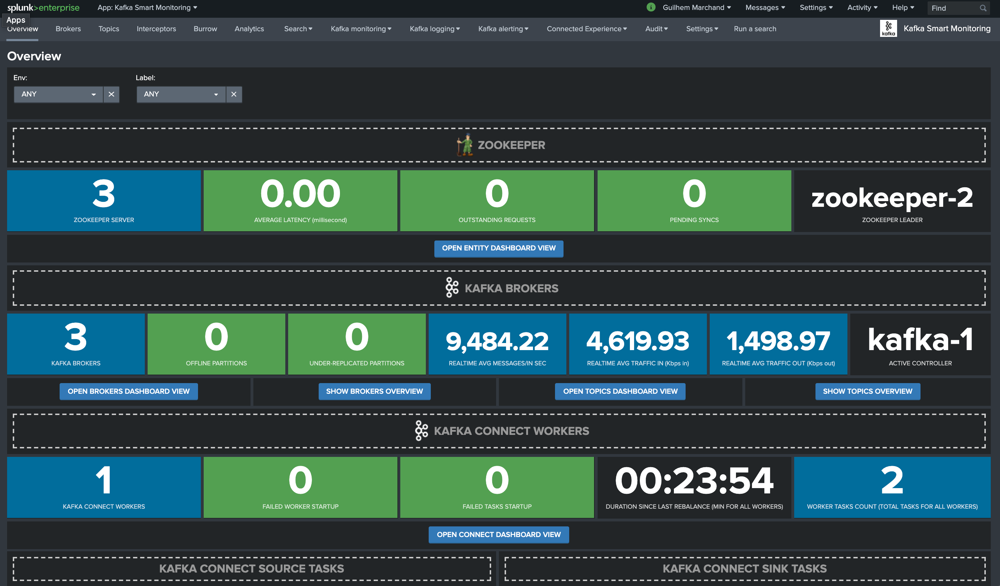

.. telegraf-kafka documentation master file, created by
   sphinx-quickstart on Tue Sep 18 23:25:46 2018.
   You can adapt this file completely to your liking, but it should at least
   contain the root `toctree` directive.

Welcome to the Splunk application for Kafka Smart Monitoring documentation
==========================================================================

**The Splunk application for Kafka Smart Monitoring with provides performance management, reporting and alerting for Kafka components metrics ingested in the Splunk metric store:**

.. image:: img/main1.png
   :alt: main1.png
   :align: center

**The application provides builtin and native monitoring for Apache Kafka components, as well as the Confluent stack components:**

* Zookeeper
* Apache Kafka Brokers
* Apache Kafka Connect
* Confluent schema-registry
* Confluent ksql-server
* Confluent kafka-rest
* Kafka SLA and end to end monitoring with the LinkedIn Kafka monitor
* Kafka Consumers lag monitoring with Burrow (Kafka Connect connectors, Kafka Streams...)

**Fully multi-tenant compatible, the application can manage different environments, data-centers, etc specially using tags at metrics low level.**

**It is recommended to read the unified guide for Kafka and Confluent monitoring first:**

https://splunk-guide-for-kafka-monitoring.readthedocs.io

Overview:
=========

.. toctree::
   :maxdepth: 2

   about
   compatibility
   knownissues
   support
   download

Deployment and configuration:
=============================

.. toctree::
   :maxdepth: 2

   deployment
   kafka_monitoring
   docker_testing
   health_view
   ootb_alerting

Troubleshoot:
=============

.. toctree::
   :maxdepth: 1

   troubleshoot

Versioniong and build history:
==============================

.. toctree::
   :maxdepth: 1

   releasenotes
