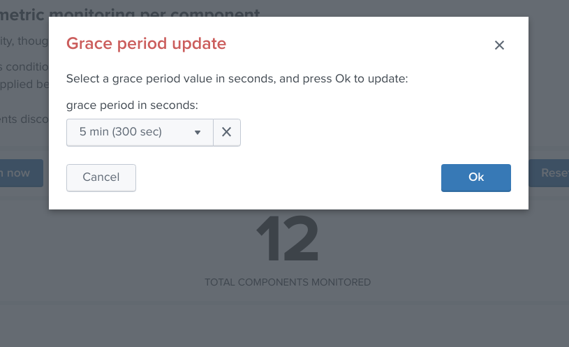

Kafka infrastructure OOTB alerting
==================================

The application provides out of the box alerting for all the components of the Kafka and Confluent infrastructure.

**Go to app menu / Settings / Management of Kafka alerting:**

.. image:: img/ootb_alerting_menu.png
   :alt: ootb_alerting_menu.png
   :align: center

Management of Kafka alerting (user interface)
#############################################

**The OOTB alerting model relies on several KVstore collections being automatically populated, the user interface "Management of Kafka alerting" allows you to interact easily with different aspects of the monitoring:**

.. image:: img/ootb_alerting_user_ui1.png
   :alt: ootb_alerting_user_ui1.png
   :align: center

KVstore collections and lookup definitions
^^^^^^^^^^^^^^^^^^^^^^^^^^^^^^^^^^^^^^^^^^

The alerting framework relies on several KVstore collections and associated lookup definitions:

+----------------------------------+-----------------------------------------------+-----------------------------------+
| Purpose                          | KVstore collection                            | Lookup definition                 |
+==================================+===============================================+===================================+
| Monitoring per component entity  | kv_telegraf_kafka_inventory                   | kafka_infra_inventory             |
+----------------------------------+-----------------------------------------------+-----------------------------------+
| Monitoring per nodes number      | kv_kafka_infra_nodes_inventory                | kafka_infra_nodes_inventory       |
+----------------------------------+-----------------------------------------------+-----------------------------------+
| Monitoring of Kafka topics       | kv_telegraf_kafka_topics_monitoring           | kafka_topics_monitoring           |
+----------------------------------+-----------------------------------------------+-----------------------------------+
| Monitoring per component entity  | kv_telegraf_kafka_connect_tasks_monitoring    | kafka_connect_tasks_monitoring    |
+----------------------------------+-----------------------------------------------+-----------------------------------+
| Monitoring per Burrow consumers  | kv_kafka_burrow_consumers_monitoring          | kafka_burrow_consumers_monitoring |
+----------------------------------+-----------------------------------------------+-----------------------------------+
| Maintenance mode management      | kv_telegraf_kafka_alerting_maintenance        | kafka_alerting_maintenance        |
+----------------------------------+-----------------------------------------------+-----------------------------------+

Permissions and authorizations
^^^^^^^^^^^^^^^^^^^^^^^^^^^^^^

Managing the alerting framework and its objects require KVstore collection and lookup definition write permissions.

You can rely on the builtin role **kafka_admin** and configure your Kafka administrators to be member of the role.

The role provides the level of permissions required to administrate the KVstore collections.

Shall an unauthorized user attempt to perform an operation, or access to an object that is no readable, the following type of error window will be showed:

Maintenance mode
^^^^^^^^^^^^^^^^

All alerts are by default driven by the status of the maintenance mode stored in a KVstore collection.

Shall the maintenance be enabled by an administrator, Splunk will continue to run the schedule alerts but none of them will be able to trigger during the maintenance time window.

When the end of maintenance time window is reached, its state will be automatically disabled and alerts will be able to trigger again.

Enabling the maintenance mode
-----------------------------

- Click on the enable maintenance mode button:

- Within the modal configuration window, enter the date and hours of the end of the maintenance time window:

- When the date and hours of the maintenance time window are reached, the scheduled report "Verify Kafka alerting maintenance status" will automatically disable the maintenance mode.

Disabling the maintenance mode
------------------------------

During any time of the maintenance time window, an administrator can decide to disable the maintenance mode:

*The collection KVstore endpoint can be programmatically managed, as such it is easily possible to reproduce this behaviour from an external system.*

(https://docs.splunk.com/Documentation/Splunk/latest/RESTREF/RESTkvstore)

Monitoring state default definition
^^^^^^^^^^^^^^^^^^^^^^^^^^^^^^^^^^^

When new objects are automatically discovered such as Kafka components or topics, these objects are added to the different KVstore collection with a default enabled maintenance mode.

The default maintenance mode that is applied on a per type of object basis can be customised via the associated macros definitions:

+---------------------------------------------+-------------------------------------------------+
| Purpose                                     | Macro definition                                |
+=============================================+=================================================+
| Type of component (nodes number monitoring) | zookeeper_default_monitoring_state              |
+---------------------------------------------+-------------------------------------------------+
| Zookeeper nodes                             | zookeeper_default_monitoring_state              |
+---------------------------------------------+-------------------------------------------------+
| Kafka Brokers                               | kafka_broker_default_monitoring_state           |
+---------------------------------------------+-------------------------------------------------+
| Kafka Topics                                | kafka_topics_default_monitoring_state           |
+---------------------------------------------+-------------------------------------------------+
| Kafka Connect workers                       | kafka_connect_default_monitoring_state          |
+---------------------------------------------+-------------------------------------------------+
| Kafka Connect connectors                    | kafka_connect_tasks_default_monitoring_state    |
+---------------------------------------------+-------------------------------------------------+
| Kafka Burrow group consumers                | kafka_burrow_consumers_default_monitoring_state |
+---------------------------------------------+-------------------------------------------------+
| Confluent Schema registry                   | schema_registry_default_monitoring_state        |
+---------------------------------------------+-------------------------------------------------+
| Confluent ksql-server                       | ksql_server_default_monitoring_state            |
+---------------------------------------------+-------------------------------------------------+
| Confluent kafka-rest                        | kafka_rest_default_monitoring_state             |
+---------------------------------------------+-------------------------------------------------+
| LinkedIn kafka-monitor                      | kafka_monitor_default_monitoring_state          |
+---------------------------------------------+-------------------------------------------------+

The default macro definition does the following statement:

::

    eval monitoring_state="enabled"

A typical customisation can be to disable by default the monitoring state for non Production environments:

::

    eval monitoring_state=if(match(env, "(?i)PROD"), "enabled", "disabled")

Such that if a new object is discovered for a development environment, this will not be monitored unless a manual update is performed via the user configuration interface.

Administrating collection entries
^^^^^^^^^^^^^^^^^^^^^^^^^^^^^^^^^

Each type of component can be administrated in a dedicated tab within the user management interface.

When objects have been discovered, the administrator can eventually search for an object, and click on the object definition, which opens the modal interaction window:

The modal interaction window provides information about this object, and different action buttons depending on this type of object:

Enable/Disabling monitoring state
---------------------------------

When an object has a disabled monitoring state, the button "enable monitoring" is automatically made available:

When an object has an enabled monitoring state, the button "disable monitoring" is automatically made available:

Shall the action be requested and confirmed, the object state will be updated, and the table exposing the object definition be refreshed.

Deleting objects in the collection
----------------------------------

An object that was discovered and added to the collection automatically can be deleted via the UI:

Shall the action be requested and confirmed, the object state will be entirely removed from the collection, and the table exposing the object definition be refreshed.

**Important:**

By default, objects are discovered every 4 hours looking at metrics available for the last 4 hours.

This means that is the object has been still generated metrics to Splunk, it will be re-created automatically by the workflow.

To avoid having to re-delete the same object again, you should wait 4 hours minimum before purging the object that was decommissioned.

Finally, note that if an object has not been generating metrics for a least 24 hours, its monitoring state will be disabled a special "disabled_autoforced" value.

This state can still be manually updated via the UI, to permanently re-enable or disable the monitoring state if the component is still an active component.

Modifying an object in the collection
-------------------------------------

Depending on the type of object, the modal interaction window can provide a modification button:

The type of modification that can be applied depends on type of component, example:

Manually request a collection update job
----------------------------------------

A collection update can be requested at any time within the UI:

Shall the action be requested and confirmed, the UI will automatically run the object discovery report, any new object that was not yet discovered since the last run of the report, will be added to the collection and made available within the UI.

Once the job has run, click on the refresh button:

=======

Enable/Disabling monitoring state
---------------------------------

When an object has a disabled monitoring state, the button "enable monitoring" is automatically made available:

When an object has an enabled monitoring state, the button "disable monitoring" is automatically made available:

Shall the action be requested and confirmed, the object state will be updated, and the table exposing the object definition be refreshed.

Deleting objects in the collection
----------------------------------

An object that was discovered and added to the collection automatically can be deleted via the UI:

Shall the action be requested and confirmed, the object state will be entirely removed from the collection, and the table exposing the object definition be refreshed.

**Important:**

By default, objects are discovered every 4 hours looking at metrics available for the last 4 hours.

This means that is the object has been still generated metrics to Splunk, it will be re-created automatically by the workflow.

To avoid having to re-delete the same object again, you should wait 4 hours minimum before purging the object that was decommissioned.

Finally, note that if an object has not been generating metrics for a least 24 hours, its monitoring state will be disabled a special "disabled_autoforced" value.

This state can still be manually updated via the UI, to permanently re-enable or disable the monitoring state if the component is still an active component.

Modifying an object in the collection
-------------------------------------

Depending on the type of object, the modal interaction window can provide a modification button:

The type of modification that can be applied depends on type of component, example:

Manually request a collection update job
----------------------------------------

A collection update can be requested at any time within the UI:

Shall the action be requested and confirmed, the UI will automatically run the object discovery report, any new object that was not yet discovered since the last run of the report, will be added to the collection and made available within the UI.

Once the job has run, click on the refresh button:

Shall the job fail for some reasons such as a lack of permissions, an error window with the Splunk error message would be exposed automatically.

Manually request a collection rebuild job
-----------------------------------------

A collection reset can be requested at any time within the UI:

**Important:** When requesting a reset of the collection, all changes will be irremediably lost.
All matching objects will be reset to their default discovered values.

Shall the action be requested and confirmed, the UI will automatically run the object discovery report, any new object that was not yet discovered since the last run of the report, will be added to the collection and made available within the UI.

.. image:: img/ootb_alerting_request_reset2.png
   :alt: ootb_alerting_request_reset2.png
   :align: center

Once the job has run, click on the refresh button:

Shall the job fail for some reasons such as a lack of permissions, an error window with the Splunk error message would be exposed automatically.

Enabling OOTB alerts
####################

**Important: By default, all alerts are disabled, you must enable the alerts within Splunk Web depending on your needs.**

You need to decide which alert must be enabled depending on your needs and environments, and achieve any additional alert actions that would be required such as creating an incident in a ticketing system.

Splunk alerts can easily be extended by alert actions.

Alert configuration summary user interface
^^^^^^^^^^^^^^^^^^^^^^^^^^^^^^^^^^^^^^^^^^

**The summary alert tab exposes most valuable information about the alerts, and provides a shortcut access to the management of the alerts:**

**Click on any alert to open the modal interaction window:**

**Click on the "Review and edit alert" button to open the Splunk alert configuration UI for this alert:**

**Click on the "Search alert history" button to automatically open a search against the triggering history for this alert**

Stale metrics life test by component
^^^^^^^^^^^^^^^^^^^^^^^^^^^^^^^^^^^^

**Life test monitoring alerts perform a verification of the metric availability to alert on a potential downtime or issue with a component.**

* Kafka monitoring - [ component ] - stale metrics life test

**Once activated, stale metrics alert verify the grace period to be applied, and the monitoring state of the component from the KVstore collection.**

**Alerts can be controlled by changing values of the fields:**

* grace_period: The grace value in seconds before assuming a severe status (difference in seconds between the last communication and time of the check)
* monitoring_state: A value of "enabled" activates verification, any other value disables it

Stale metrics life test by number of nodes per type of component
^^^^^^^^^^^^^^^^^^^^^^^^^^^^^^^^^^^^^^^^^^^^^^^^^^^^^^^^^^^^^^^^

**If you are running the Kafka components in a container based architecture, you can monitor your infrastructure availability by monitoring the number of active nodes per type of component.**

As such, you will be monitoring how many nodes are active at a time, rather than specific nodes identities which will change with the life cycle of the containers.

* All Kafka components - active node numbers - stale metrics life test

Shall an upgrade of a statefullSet or deployment in Kubernetes fail and new containers fail to start, the OOTB alerting will report this bad condition on per type of component basis.

Kafka brokers monitoring
^^^^^^^^^^^^^^^^^^^^^^^^

**The following alerts are available to monitor the main and most important aspects of Kafka Broker clusters:**

* Abnormal number of Active Controllers
* Offline or Under-replicated partitions
* Failed producer or consumer was detected
* ISR Shrinking detection

Kafka topics monitoring
^^^^^^^^^^^^^^^^^^^^^^^

**The following alerts are available to monitor Kafka topics:**

* Under-replicated partitions detected on topics
* Errors reported on topics (bytes rejected, failed fetch requests, failed produce requests)

Kafka Connect task monitoring
^^^^^^^^^^^^^^^^^^^^^^^^^^^^^

**Alerts are available to monitor the state of connectors and tasks for Kafka Connect:**

* Kafka monitoring - Kafka Connect - tasks status monitoring

**Alerts can be controlled by changing values of the fields:**

* grace_period: The grace value in seconds before assuming a severe status (difference in seconds between the last communication and time of the check)
* monitoring_state: A value of "enabled" activates verification, any other value disables it

Kafka Consumers monitoring with Burrow
^^^^^^^^^^^^^^^^^^^^^^^^^^^^^^^^^^^^^^

**Alerts are available to monitor and report the state of Kafka Consumers via Burrow:**

* Kafka monitoring - Burrow - group consumers state monitoring

**Alerts can be controlled by changing values of the fields:**

* monitoring_state: A value of "enabled" activates verification, any other value disables it

Notes: Kafka Connect source and sink connectors depending on their type are as well consumers, Burrow will monitor the way the connectors behave by analysing their lagging metrics and type of activity, this is a different, complimentary and advanced type of monitoring than analysing the state of the tasks.

Programmatic access and interactions with external systems
##########################################################

Requirements and recommendations
^^^^^^^^^^^^^^^^^^^^^^^^^^^^^^^^

- Create a Splunk service account user that is member of the builtin **kafka_admin** role

- The builtin **kafka_admin** role provides read and write permission to the different KVstore collections

- Make sure splunkd REST API is reachable from your external tool

References
^^^^^^^^^^

- http://dev.splunk.com/view/webframework-developapps/SP-CAAAEZG

- https://docs.splunk.com/Documentation/Splunk/latest/RESTREF/RESTprolog

- https://docs.splunk.com/Documentation/Splunk/latest/RESTTUT/RESTandCloud

- https://www.urlencoder.org/ (example online tool to URIencode / decode)

For convenience of the documentation bellow
^^^^^^^^^^^^^^^^^^^^^^^^^^^^^^^^^^^^^^^^^^^

::

    export username="svc_kafka"
    export password="my_password"
    export splunk_url="localhost:8089"

Maintenance mode management
^^^^^^^^^^^^^^^^^^^^^^^^^^^

Get the current maintenance mode status
---------------------------------------

::

    curl -k -u $username:$password \
        https://$splunk_url/servicesNS/nobody/telegraf-kafka/storage/collections/data/kv_telegraf_kafka_alerting_maintenance

Enabling the maintenance mode
-----------------------------

Enabling the maintenance mode requires:

- a first operation that flushed any record of the KVstore collection
- a value for the end of the maintenance period in epochtime (field maintenance_mode_end)
- the current time in epochtime (field time_updated)

*Example: Enable the maintenance mode till the 11 of May 2019 at 9.pm*

::

    curl -k -u $username:$password -X DELETE \
        https://$splunk_url/servicesNS/nobody/telegraf-kafka/storage/collections/data/kv_telegraf_kafka_alerting_maintenance

    curl -k -u $username:$password \
        https://$splunk_url/servicesNS/nobody/telegraf-kafka/storage/collections/data/kv_telegraf_kafka_alerting_maintenance \
        -H 'Content-Type: application/json' \
        -d '{"maintenance_mode": "enabled", "maintenance_mode_end": "1557565200", "time_updated": "1557509578"}'

Disabling the maintenance mode
------------------------------

Disabling the maintenance mode requires:

- a first operation that flushed any record of the KVstore collection
- the current time in epochtime (field time_updated)

::

    curl -k -u $username:$password -X DELETE \
        https://$splunk_url/servicesNS/nobody/telegraf-kafka/storage/collections/data/kv_telegraf_kafka_alerting_maintenance

    curl -k -u $username:$password \
        https://$splunk_url/servicesNS/nobody/telegraf-kafka/storage/collections/data/kv_telegraf_kafka_alerting_maintenance \
        -H 'Content-Type: application/json' \
        -d '{"maintenance_mode": "disabled", "maintenance_mode_end": "", "time_updated": "1557509578"}'

Kafka Connect task monitoring management
^^^^^^^^^^^^^^^^^^^^^^^^^^^^^^^^^^^^^^^^

Retrieve all the records from the KVstore
-----------------------------------------

::

    curl -k -u $username:$password \
        https://$splunk_url/servicesNS/nobody/telegraf-kafka/storage/collections/data/kv_telegraf_kafka_connect_tasks_monitoring

Request tasks inventory update: automatically Add any new task to the collection
--------------------------------------------------------------------------------

::

    curl -u $username:$password -k https://$splunk_url/servicesNS/$username/telegraf-kafka/search/jobs -d search="| savedsearch \"Update Kafka Connect tasks inventory\""

Create a new connector to be monitored
--------------------------------------

**Create a new connector entry which enables monitoring for the connector, with recommended fields (env, label, connector, role):**

*Example:*

::

    {"env": "docker_env", "label": "testing", "connector": "kafka-connect-my-connector", "role": "kafka_sink_task", "monitoring_state": "enabled", "grace_period": "300"}

::

    curl -k -u $username:$password \
        https://$splunk_url/servicesNS/nobody/telegraf-kafka/storage/collections/data/kv_telegraf_kafka_connect_tasks_monitoring \
        -H 'Content-Type: application/json' \
        -d '{"env": "docker_env", "label": "testing", "connector": "kafka-connect-my-connector", "role": "kafka_sink_task", "monitoring_state": "enabled", "grace_period": "300"}'

Get the entries for a specific connector
----------------------------------------

*example:*

::

    query={"env": "docker_env", "label": "testing", "connector": "kafka-connect-my-connector"}

**Encode the URL and use a query:**

*Notes: URI encode everything after the "query="*

::

    curl -k -u $username:$password \
        https://$splunk_url/servicesNS/nobody/telegraf-kafka/storage/collections/data/kv_telegraf_kafka_connect_tasks_monitoring?query=%7B%22connector%22%3A%20%22kafka-connect-my-connector%22%7D

Delete a Kafka connector
------------------------

**Delete the record with the key ID " 5410be5441ba15298e4624d1":**

::

    curl -k -u $username:$password -X DELETE \
        https://$splunk_url/servicesNS/nobody/telegraf-kafka/storage/collections/data/kv_telegraf_kafka_connect_tasks_monitoring/5410be5441ba15298e4624d1

Deactivating the monitoring state of a connector
------------------------------------------------

**Using a search triggered via rest call: (a different method is possible by altering the record, see after)**

- modify <$username> to match the username of the service account used to connect to

::

    curl -u $username:$password -k https://$splunk_url/servicesNS/$username/telegraf-kafka/search/jobs -d search="| inputlookup kafka_connect_tasks_monitoring | search env=\"docker_env\" label=\"testing\" connector=\"kafka-connect-syslog\" | eval monitoring_state=\"disabled\" | outputlookup kafka_connect_tasks_monitoring append=t key_field=_key"

**Or using a rest call (all wanted fields have to be mentioned):**

- get the key ID, and if required get the current value of every field to be preserved

::

    curl -k -u $username:$password \
        https://$splunk_url/servicesNS/nobody/telegraf-kafka/storage/collections/data/kv_telegraf_kafka_connect_tasks_monitoring/5cd5a890e3b965791163eb71 \
        -H 'Content-Type: application/json' \
        -d '{"env": "docker_env", "label": "testing", "connector": "kafka-connect-my-connector", "role": "kafka_sink_task", "monitoring_state": "disabled", "grace_period": "300"}'

Activating the monitoring state of a connector
----------------------------------------------

**Using a search triggered via rest call: (a different method is possible by altering the record, see after)**

- modify <$username> to match the username of the service account used to connect to

::

    curl -u $username:$password -k https://$splunk_url/servicesNS/$username/telegraf-kafka/search/jobs -d search="| inputlookup kafka_connect_tasks_monitoring | search env=\"docker_env\" label=\"testing\" connector=\"kafka-connect-syslog\" | eval monitoring_state=\"enabled\" | outputlookup kafka_connect_tasks_monitoring append=t key_field=_key"

**Or using a rest call (all wanted fields have to be mentioned):**

- get the key ID, and if required get the current value of every field to be preserved

::

    curl -k -u $username:$password \
        https://$splunk_url/servicesNS/nobody/telegraf-kafka/storage/collections/data/kv_telegraf_kafka_connect_tasks_monitoring/5cd5a890e3b965791163eb71 \
        -H 'Content-Type: application/json' \
        -d '{"env": "docker_env", "label": "testing", "connector": "kafka-connect-my-connector", "role": "kafka_sink_task", "monitoring_state": "enabled", "grace_period": "300"}'

Delete a connector
------------------

*example:*

::

    query={"env": "docker_env", "label": "testing", "connector": "kafka-connect-my-connector"}

**Encode the URL and use a query:**

*Notes: URI encode everything after the "query="*

::

    curl -k -u $username:$password \
        https://$splunk_url/servicesNS/nobody/telegraf-kafka/storage/collections/data/kv_telegraf_kafka_connect_tasks_monitoring?query=%7B%22connector%22%3A%20%22kafka-connect-my-connector%22%7D

**Delete the record using the key ID:**

::

    curl -k -u $username:$password -X DELETE \
        https://$splunk_url/servicesNS/nobody/telegraf-kafka/storage/collections/data/kv_telegraf_kafka_connect_tasks_monitoring/5410be5441ba15298e4624d1
