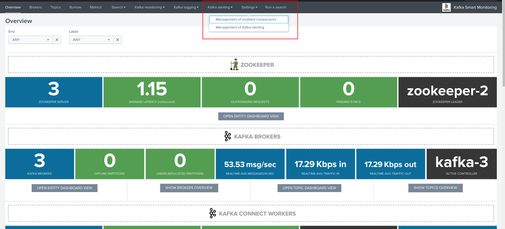
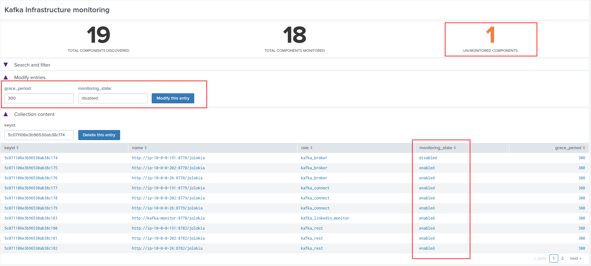

Kafka infrastructure OOTB alerting
==================================

The Splunk application provides out of the box alerting for all the components of the Kafka and Confluent infrastructure.

**Go straight to the Kafka alerting in app menu:**

Management of Kafka alerting (user interface)
#############################################

**The OOTB alerting model relies on several KVstore collections being automatically populated, the user interface "Management of Kafka alerting" allows you to interact easily with different aspects of the monitoring:**

* The Kafka infrastructure collection (kv_telegraf_kafka_inventory) contains all the components that were discovered, and is used for the stale metrics life test monitoring

* The Kafka topics collection (kv_telegraf_kafka_topics_monitoring) contains the topics discovered, with their monitoring status (enabled by default)

* The Kafka Connect tasks collection (kv_telegraf_kafka_connect_tasks_monitoring) contains the list of source and sink Connect tasks disovered, with their monitoring status (enabled by default)

Maintenance mode
^^^^^^^^^^^^^^^^

All alerts are by default driven by the status of the maintenance mode stored in the kv_telegraf_kafka_alerting_maintenance collection.

If you action the maintenance mode within the UI, this flushes the KVstore collection and will enable the maintenance mode.

Once the maintenance mode is activated, all alerts will still be running but none of them will be able to trigger during the maintenance time.

When the maintenance period is over, just disable the maintenance mode and any alert that would meet a condition will trigger as normally.

The maintenance mode has been designed to allow you massively disabling all alerts triggering at once from Splunk.

*Maintenance mode is activated:*

Notes: The collection KVstore endpoint can be programmatically managed, as such it is easily possible to reproduce this behaviour from an external system. (https://docs.splunk.com/Documentation/Splunk/latest/RESTREF/RESTkvstore)

Modifying entries (monitoring state, grace period)
^^^^^^^^^^^^^^^^^^^^^^^^^^^^^^^^^^^^^^^^^^^^^^^^^^

Each of the entities monitored, such as instances, topics and Connect tasks, have a monitoring status stored in the respective collection.

* monitoring_state="enabled"

You can use the user interface to change this status to disabled, such that even if the conditions are met and the alert is activated, Splunk will not trigger an alert based on the status.

Select an entity to get the fields and key identifier populated automatically, achieve your modification and press the modify button:

When an entity monitoring status is disabled, the single form will account this information.

Deleting entries
^^^^^^^^^^^^^^^^

You can use the interface to delete entries from the collections, entries (new components discovered) are added automatically but never deleted.

Select the entity in the table to get the key identifier populated automatically, and use the delete button to remove this entity:

If these entities are still active and reporting metrics, the entity will be re-created automatically. In such a case it is preferable to disable its monitored state as long as the entity remains active.

Enabling OOTB alerts
####################

**By default, all alerts are disabled.**

You need to decide which alert must be enabled depending on your needs and environments, and achieve any additional alert actions that would be required such as creating an incident in a ticketing system.

Splunk alerts can easily be extended by alert actions.

**Go straight to the Kafka alerting / Alerts configuration in app menu and enable your alerts.**

Stale metrics life test
^^^^^^^^^^^^^^^^^^^^^^^

**Important: All alerts are disabled by default, and must be enabled depending on your needs**

Life test monitoring alerts perform a verification of the metric availability to alert on a potential downtime or issue with a component.

* Kafka monitoring - [ component ] - stale metrics life test

**Once activated, stale metrics alert verify the grace period to be applied, and the monitoring state of the component from the KVstore collection.**

**Alerts can be controlled by changing values of the fields:**

* grace_period: The grace value in seconds before assuming a severe status (difference in seconds between the last communication and time of the check)
* monitoring_state: A value of "enabled" activates verification, any other value disables it

**Collection content update:**

The content of the collection is automatically generated by the night time scheduled report:

* Update Kafka Infrastructure components inventory

Once a component has been added to the collection, it will not be overwritten nor modified or deleted, and modifications can be made and saved safely.

Kafka brokers monitoring
^^^^^^^^^^^^^^^^^^^^^^^^

**Important: All alerts are disabled by default, and must be enabled depending on your needs**

**Alerts are available to monitor the main and most important items for Kafka brokers:**

* Abnormal number of Active Controllers
* Offline or Under-replicated partitions
* Failed producer or consumer was detected
* ISR Shrinking detection

Kafka topics monitoring
^^^^^^^^^^^^^^^^^^^^^^^

**Important: All alerts are disabled by default, and must be enabled depending on your needs**

Topics are monitored depending on their monitored state:

* Under-replicated partitions detected on topics
* Errors reported on topics (bytes rejected, failed fetch requests, failed produce requests)

Kafka Connect task monitoring
^^^^^^^^^^^^^^^^^^^^^^^^^^^^^

**Important: All alerts are disabled by default, and must be enabled depending on your needs**

**Alerts are available to monitor the state of connectors and tasks for Kafka Connect:**

* Kafka monitoring - Kafka Connect - tasks status monitoring

**Alerts can be controlled by changing values of the fields:**

* grace_period: The grace value in seconds before assuming a severe status (difference in seconds between the last communication and time of the check)
* monitoring_state: A value of "enabled" activates verification, any other value disables it

**Collection content update:**

The content of the collection is automatically generated by the night time scheduled report:

* Update Kafka Infrastructure components inventory

Once a component has been added to the collection, it will not be overwritten nor modified or deleted, and modifications can be made and saved safely.
