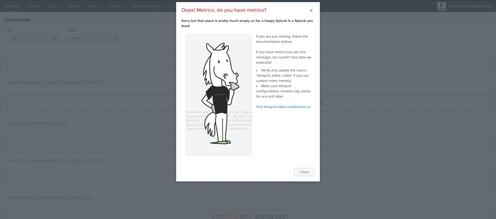
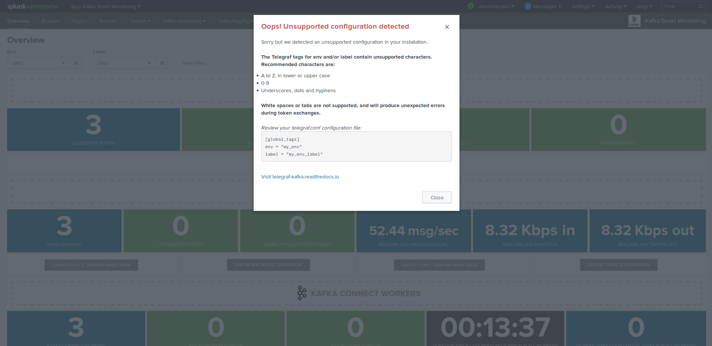

Troubleshoot & FAQ
==================

No metrics data could be found
##############################

Shall the application not be able to find any Kafka metrics in Splunk in respect with your configuration, the Overview landing page will show the following modal message:

Root causes can be:

- No metrics could be collected by Telegraf

- Telegraf cannot send the metrics to your Splunk HEC endpoint

- The index name differs from the default "telegraf_kafka" index and the macro "telegraf_kafka_index" was not customised

- Telegraf configuration does not provide a value for env and label tags

Unsupported configuration detected in tags
##########################################

The value for env and label tags must not contain any white spaces or tabs to avoid token exchange issues in the dashboard navigation.

Shall this be the case, a modal error window will open automatically when opening the Overview page:

If this happens, then your Telegraf tags are incorrect, fix your telegraf.conf configuration files, example:

::

    [global_tags]
      # the env tag is used by the application for multi-environments management
      env = "docker_env"
      # the label tag is an optional tag used by the application that you can use as additional label for the services or infrastructure
      label = "testing_env"

Once the fix has been applied properly, the error message will disappear.
